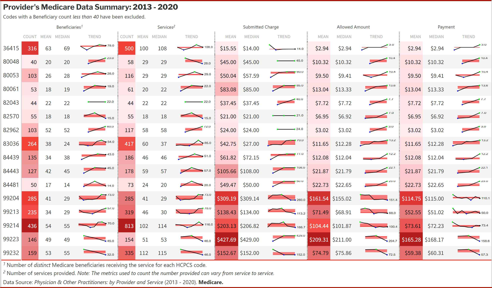
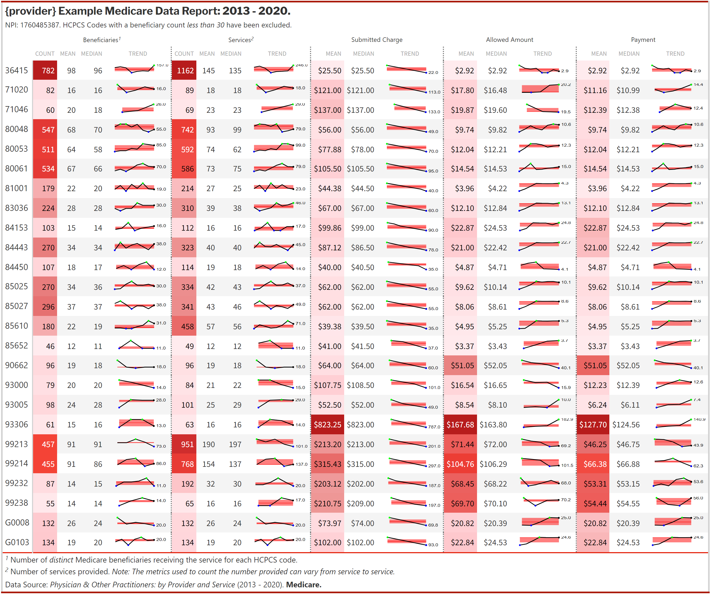
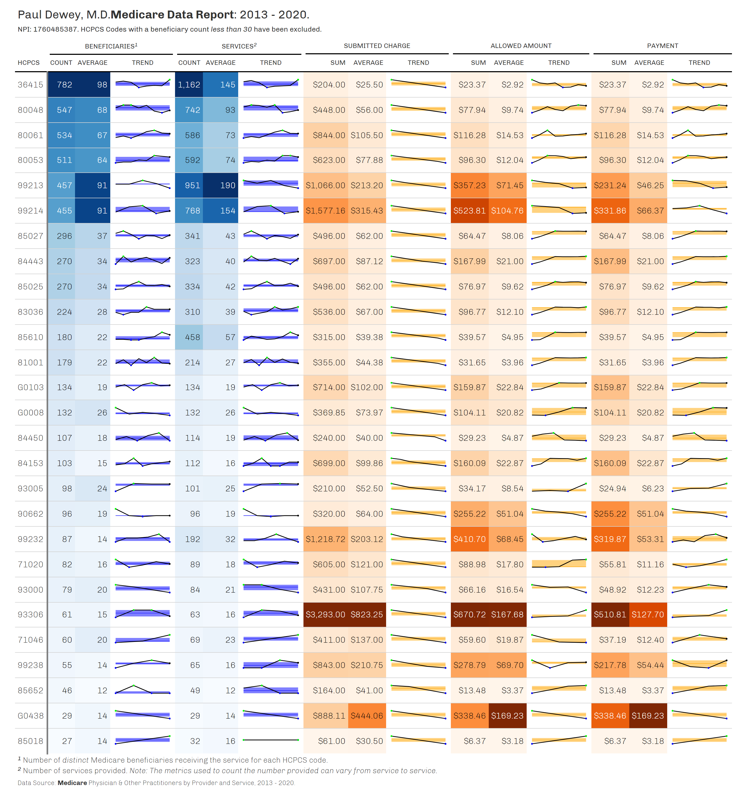

<!-- README.md is generated from README.Rmd. Please edit that file -->

```{r, include = FALSE}
knitr::opts_chunk$set(
  collapse  = TRUE,
  echo      = TRUE, 
  message   = FALSE, 
  warning   = FALSE,
  error = TRUE,
  comment = "#>",
  dpi = 150, 
  out.width = "100%",
  fig.path = "man/figures/README-"
)
```

# `provider` 

<!-- badges: start -->
[](https://github.com/andrewallenbruce/provider/actions/workflows/R-CMD-check.yaml)
[](https://lifecycle.r-lib.org/articles/stages.html#experimental)
[](https://www.repostatus.org/#wip)
[](https://choosealicense.com/licenses/mit/)
[](https://github.com/andrewallenbruce/provider)
[](https://github.com/andrewallenbruce/provider/commits/main)
[](https://app.codecov.io/gh/andrewallenbruce/provider?branch=main)
<!-- badges: end -->

The goal of `provider` is to provide performant and reliable open-source tools to facilitate easy access to [healthcare provider](https://en.wikipedia.org/wiki/Health_care_provider) data through publicly available APIs & sources. The current list of supported APIs are:

<br>

 *  [NPPES National Provider Identifier (NPI) Registry API](https://npiregistry.cms.hhs.gov/search)
 *  [Medicare Fee-For-Service Public Provider Enrollment API](https://data.cms.gov/provider-characteristics/medicare-provider-supplier-enrollment/medicare-fee-for-service-public-provider-enrollment)
 *  [Medicare Order and Referring API](https://data.cms.gov/provider-characteristics/medicare-provider-supplier-enrollment/medicare-fee-for-service-public-provider-enrollment)
 *  [Medicare Provider and Supplier Taxonomy Crosswalk API](https://data.cms.gov/provider-characteristics/medicare-provider-supplier-enrollment/medicare-provider-and-supplier-taxonomy-crosswalk)
 *  [Medicare Physician & Other Practitioners API](https://data.cms.gov/provider-summary-by-type-of-service/medicare-physician-other-practitioners/medicare-physician-other-practitioners-by-provider-and-service)
 *  [Medicare Revalidation Due Date API](https://data.cms.gov/provider-characteristics/medicare-provider-supplier-enrollment/revalidation-due-date-list)
 *  [Medicare Revalidation Clinic Group Practice Reassignment API](https://data.cms.gov/provider-characteristics/medicare-provider-supplier-enrollment/revalidation-clinic-group-practice-reassignment)
 *  [Medicare Opt Out Affidavits API](https://data.cms.gov/provider-characteristics/medicare-provider-supplier-enrollment/opt-out-affidavits)
 *  [Medicare Market Saturation & Utilization State-County API](https://data.cms.gov/summary-statistics-on-use-and-payments/program-integrity-market-saturation-by-type-of-service/market-saturation-utilization-state-county)
 *  [Medicare Provider of Services File - Clinical Laboratories API](https://data.cms.gov/provider-characteristics/hospitals-and-other-facilities/provider-of-services-file-clinical-laboratories)
 *  [CMS Public Reporting of Missing Digital Contact Information API](https://data.cms.gov/provider-compliance/public-reporting-of-missing-digital-contact-information)
 *  [NIH NLM Clinical Table Service ICD-10-CM API](https://clinicaltables.nlm.nih.gov/apidoc/icd10cm/v3/doc.html)
 
<br>

## Installation

You can install the development version of `provider` from [GitHub](https://github.com/) with:

``` r
# install.packages("devtools")
devtools::install_github("andrewallenbruce/provider")

# install.packages("remotes")
remotes::install_github("andrewallenbruce/provider")
```
<br>

<br>

## Motivating Example


You're billing for a healthcare provider and receive a `CO-8` denial on a claim and you need to confirm whether or not the correct taxonomy code was entered on the claim. Armed with the provider's NPI, you can search the **NPPES NPI Registry API** with the `provider_nppes()` function:

<br>

```{r warning=FALSE}
# Load library
library(provider)

# Query the NPPES API
nppes_ex <- provider_nppes(npi = 1760485387)
```

<br>

```{r echo=FALSE}
nppes_ex
```

<br>

Unpack the API response with the `provider_unpack()` function:

<br>

```{r}
nppes_ex <- provider_unpack(nppes_ex)
```

<br>

```{r}
nppes_ex
```
<br>

Filter and wrangle the data for presentation:

<br>

```{r echo=FALSE}
nppes_ex |> 
  dplyr::select("NPI"           = npi, 
                "Last Name"     = last_name,
                "Provider Type" = prov_type, 
                "Code"          = taxon_code, 
                "Primary"       = taxon_primary, 
                "Description"   = taxon_desc, 
                "State"         = taxon_state, 
                "License"       = taxon_license) |> 
  dplyr::distinct(Primary, .keep_all = TRUE) |> 
  knitr::kable()
```

<br>

What if you don't have the provider's NPI? You can search by first and/or last name, city, state:

<br>

```{r warning=FALSE}
nppes_ex2 <- provider_nppes(first = "Paul", 
                            last  = "Dewey",
                            state = "MN") |> 
                            provider_unpack()
```

<br>

```{r echo=FALSE}
nppes_ex2 |> 
  dplyr::select("NPI"           = npi, 
                "Last Name"     = last_name,
                "Provider Type" = prov_type, 
                "Code"          = taxon_code, 
                "Primary"       = taxon_primary, 
                "Description"   = taxon_desc, 
                "State"         = taxon_state, 
                "License"       = taxon_license) |> 
  dplyr::distinct(Primary, .keep_all = TRUE) |> 
  knitr::kable()
```
<br> 

What if you need the provider's PECOS PAC ID or Enrollment ID? Using the `provider_mppe()` function, you can search Medicare's **Fee-For-Service Public Provider Enrollment API**:

<br>

```{r}
mppe_ex <- provider_mppe(1760485387)
```

<br>

```{r echo=FALSE}
mppe_ex |> dplyr::select(
                "NPI"             = npi, 
                "Last Name"       = last_name,
                "PECOS PAC ID"    = pecos_asct_cntl_id, 
                "PECOS Enroll ID" = enrlmt_id, 
                "Specialty"       = provider_type_desc, 
                "State"           = state_cd) |> 
                knitr::kable()
```

<br>

Is the provider currently eligible to make referrals to Medicare Part B or a Home Health Agency (HHA)? Order Durable Medical Equipment (DME) or Power Mobility Devices (PMDs)? Search Medicare's **Order and Referring API** with `provider_moar()`:

<br>

```{r}
moar_ex <- provider_moar(1760485387)
```

<br>

```{r echo=FALSE}
moar_ex |> dplyr::select(
                "NPI"        = npi, 
                "Last Name"  = last_name,
                "First Name" = first_name, 
                "Part B"     = partb, 
                "DME"        = dme,
                "HHA"        = hha, 
                "PMD"        = pmd) |> 
                knitr::kable()
```

<br>

You may need to find Medicare's specialty codes for this provider's taxonomies. Using the output from the NPPES search in the first example, you can search Medicare's **Provider and Supplier Taxonomy Crosswalk API** with `provider_mpstc()`:

<br>

```{r}
mpstc_ex <- nppes_ex |> 
            dplyr::distinct(taxon_code) |> 
            dplyr::group_split(taxon_code) |> 
            purrr::map_dfr(provider_mpstc)
```

<br>

```{r echo=FALSE}
mpstc_ex |> 
  dplyr::select("Taxonomy Code"           = provider_taxonomy_code, 
                "Medicare Specialty Code" = medicare_specialty_code,
                "Specialty"               = medicare_provider_supplier_type_description, 
                "Classification"          = provider_taxonomy_description_type_classification_specialization) |> 
                knitr::kable()
```

<br>

You can check to see if a provider is due to revalidate their Medicare enrollment by accessing Medicare's **Revalidation Due Date API** with `provider_mrdd()`:

<br>

```{r}
mrdd_ex <- provider_mrdd(1760485387)
```

<br>

```{r echo=FALSE}
mrdd_ex |> dplyr::select("NPI"                   = national_provider_identifier, 
                         "Enrollment ID"         = enrollment_id,
                         "Enrollment Type"       = enrollment_type,
                         "Last Name"             = last_name,
                         "State"                 = enrollment_state_code,
                         "Provider Type"         = provider_type_text, 
                         "Specialty"             = enrollment_specialty,
                         "Revalidation Due Date" = revalidation_due_date) |> 
                         knitr::kable()
```

<br>

Providers may need to update their digital contact information in the NPPES system. To check, you can access the **CMS Public Reporting of Missing Digital Contact Information API** with `provider_promdci()`. If they appear in the search results, it's time to update their NPPES contact information:

<br>

```{r}
promdci_ex <- provider_promdci(1760485387)
```

<br>

```{r echo=FALSE}
promdci_ex |> 
  dplyr::select("NPI"           = npi, 
                "Provider Name" = provider_name) |> 
                knitr::kable()
```
<br>

You can find out if a provider has opted out of Medicare by searching the **Medicare Opt Out Affidavits API** with `provider_mooa()`:

<br>

```{r}
mooa_ex <- provider_mooa(1114974490)
```

<br>

```{r echo=FALSE}
mooa_ex |> dplyr::select(
           NPI                            = npi,
           Last                           = last_name,
           First                          = first_name,
           optout_effective_date,
           optout_end_date,
           "Order & Refer Eligible"       = eligible_to_order_and_refer,
           Updated                        = last_updated,
           Specialty                      = specialty,
           Address                        = first_line_street_address,
           City                           = city_name,
           State                          = state_code) |>
           provider::days_today(optout_end_date) |> 
           dplyr::rename("Opt-Out Begins" = optout_effective_date, 
                         "Opt-Out Ends"   = optout_end_date) |> 
           knitr::kable()
```

<br>

`provider_rcgpr()` accesses **Medicare's Revalidation Clinic Group Practice Reassignment API**:

<br>

```{r}
rcgpr_ex <- provider_rcgpr(npi = 1760485387)
```

<br>

```{r echo=FALSE}
rcgpr_ex |> dplyr::select("NPI"                                  = individual_npi,
                          "Last"                                 = individual_last_name,
                          "Type"                                 = record_type,
                          "PAC ID Group "                        = group_pac_id,
                          "Enroll ID Group"                      = group_enrollment_id,
                          "Business Name"                        = group_legal_business_name,
                          "Due Date Group"                       = group_due_date,
                          "PAC ID Ind"                           = individual_pac_id,
                          "Enroll ID Ind"                        = individual_enrollment_id,
                          "Due Date Ind"                         = individual_due_date,
                          "Reassignments & Phys Assts"           = group_reassignments_and_physician_assistants,
                          "Employer Associations"                = individual_total_employer_associations) |> 
            knitr::kable()
```

<br>

Using `provider_mpop()`, you can access **Medicare's Physician & Other Practitioners API**, enabling you to choose between three related datasets: 

> 1. by Provider and Service API:

<br>

```{r}
mpop_serv_ex <- provider_mpop(npi = 1760485387, 
                              set = "serv",
                              year = "2020")
```

<br>

```{r echo=FALSE}
mpop_serv_ex |> dplyr::select(NPI             = rndrng_npi,
                              Last            = rndrng_prvdr_last_org_name,
                              City            = rndrng_prvdr_city,
                              State           = rndrng_prvdr_state_abrvtn,
                              PAR             = rndrng_prvdr_mdcr_prtcptg_ind,
                              HCPCS           = hcpcs_cd,
                              Beneficiaries   = tot_benes,
                              "Services"      = tot_srvcs,
                              "Avg Billed"    = avg_sbmtd_chrg,
                              "Avg Allowed"   = avg_mdcr_alowd_amt,
                              "Avg Payment"   = avg_mdcr_pymt_amt) |>
                              knitr::kable()
```
<br>

> 2. by Geography and Service API:

<br>

```{r}
mpop_geo_ex <- provider_mpop(hcpcs = "99214", 
                             set   = "geo",
                             year  = "2020")
```

<br>

```{r echo=FALSE}
mpop_geo_ex |> dplyr::select(Year                                      = year,
                             HCPCS                                     = hcpcs_cd,
                             Level                                     = rndrng_prvdr_geo_lvl,
                             Region                                    = rndrng_prvdr_geo_desc,
                             FIPS                                      = rndrng_prvdr_geo_cd,
                             POS                                       = place_of_srvc,
                             Providers                                 = tot_rndrng_prvdrs,
                             Beneficiaries                             = tot_benes, 
                             Services                                  = tot_srvcs, 
                             "Distinct Beneficiaries Per Day Services" = tot_bene_day_srvcs,
                             "Avg Charge"                              = avg_sbmtd_chrg, 
                             "Avg Allowed"                             = avg_mdcr_alowd_amt, 
                             "Avg Payment"                             = avg_mdcr_pymt_amt, 
                             "Avg Standard Pymt"                       = avg_mdcr_stdzd_amt) |> 
                knitr::kable()
```

<br>

> 3. by Provider API:

<br>

```{r}
mpop_prov_ex <- provider_mpop(npi  = 1003000134, 
                              set  = "prov",
                              year = "2020")
```

<br>

```{r echo=FALSE}
mpop_prov_ex |> lobstr::tree()
```

<br>

`provider_clia()` accesses **Medicare's Provider of Services File for Clinical Laboratories API**:

<br>

```{r}
clia_ex <- provider_clia(name = "carbon hill", 
                         year = "2022")
```

<br>

```{r echo=FALSE}
clia_ex |> lobstr::tree()
```


Using packages like {gt} & {ggplot2}, you can create tables and graphs for reporting purposes:

<br>


<br>

{width="100%"}

{width="100%"}

{width="100%"}

<br>
<br>

------------------------------------------------------------------------------

## Code of Conduct

Please note that the provider project is released with a [Contributor Code of Conduct](https://andrewallenbruce.github.io/provider/CODE_OF_CONDUCT.html). By contributing to this project, you agree to abide by its terms.
