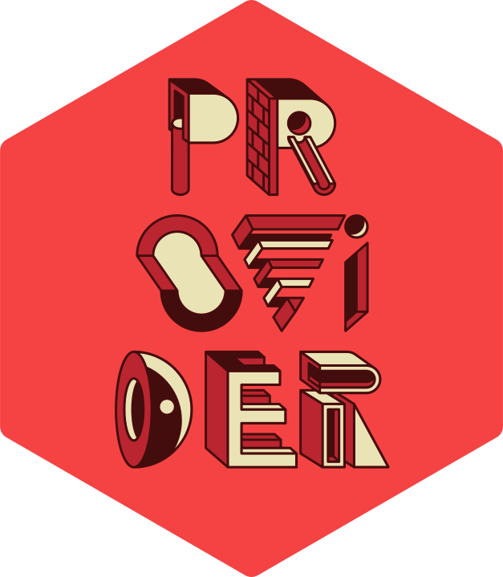

<!-- README.md is generated from README.Rmd. Please edit that file -->

```{r}
#| label: setup
#| include: FALSE
knitr::opts_chunk$set(
  collapse  = TRUE,
  echo      = TRUE,
  message   = TRUE, 
  warning   = FALSE,
  error     = TRUE,
  comment   = "",
  fig.path = "man/figures/README-",
  out.width = "100%"
  )
library(tibble)
```

# <b>provider</b> <a href="https://andrewallenbruce.github.io/provider/"></a>

> <b>Tidy Healthcare Provider API Interface</b>

<!-- badges: start -->


[](https://choosealicense.com/licenses/mit/)
<br>
[](https://github.com/andrewallenbruce/provider)
[](https://github.com/andrewallenbruce/provider/commits/main)
<br>
[](https://app.codecov.io/gh/andrewallenbruce/provider?branch=main)
[](https://www.codefactor.io/repository/github/andrewallenbruce/provider)
<br>

<!-- badges: end -->

You can install `provider` from [GitHub](https://github.com/) with:

```r
# install.packages("pak")
pak::pak("andrewallenbruce/provider")
```

### :beginner: Usage

```{r}
#| label: load
#| echo: TRUE
#| message: TRUE
#| warning: FALSE
library(provider)
```

```{r}
#| label: affiliations
# Provider/Facility Affiliations
affiliations(facility_ccn = 370781)
```

```{r}
#| label: reassignments
# Reassignment of Benefits
reassignments(
  first = starts_with("J"), 
  state = "GA", 
  specialty = contains("Gastro"))
```

```{r}
#| label: revocations
# Revoked Medicare Providers
revocations(
  specialty = contains("CARDIO"), 
  state = not("TX"))
```

```{r}
#| label: clinicians
# Clinician Demographics
clinicians(
  state = "GA", 
  gender = "F",
  specialty = "Nurse Practitioner",
  org_name = starts_with("North"),
  grad_year = 2024)
```

```{r}
#| label: opt_out
# Opt-Out Affidavits
opt_out(
  specialty = "Psychiatry", 
  order_refer = FALSE)
```

```{r}
#| label: order_refer
# Ordering & Referral Eligibility
order_refer(
  last = contains("ABAY"),
  ptb = TRUE,
  dme = TRUE,
  hha = FALSE)
```

```{r}
#| label: pending
# Pending Enrollments
pending(
  first = ends_with("E"),
  last = starts_with("A"))
```

```{r}
#| label: providers
# Medicare Enrollment
providers(
  first = contains("C"),
  state = "AK",
  prov_type = ends_with(50))
```

```{r}
#| label: hospitals
# Medicare Part A Hospitals
hospitals(
  state = "GA",
  subgroup = subgroups(
    acute = FALSE,
    psych = TRUE))
```

```{r}
#| label: clia
# CLIA Laboratories
clia(parent = starts_with(11), city = "Valdosta")
```

```{r}
#| label: transparency
# Hospital Transparency Enforcement
transparency(action = "warn", state = c("AL", "GA"))
```

<br>

------------------------------------------------------------------------------

<br>

## :balance_scale: Code of Conduct

Please note that the `provider` project is released with a [Contributor Code of Conduct](https://andrewallenbruce.github.io/provider/CODE_OF_CONDUCT.html). By contributing to this project, you agree to abide by its terms.


## :classical_building: Governance

This project is primarily maintained by [Andrew Bruce](https://github.com/andrewallenbruce). Other authors may occasionally assist with some of these duties.
