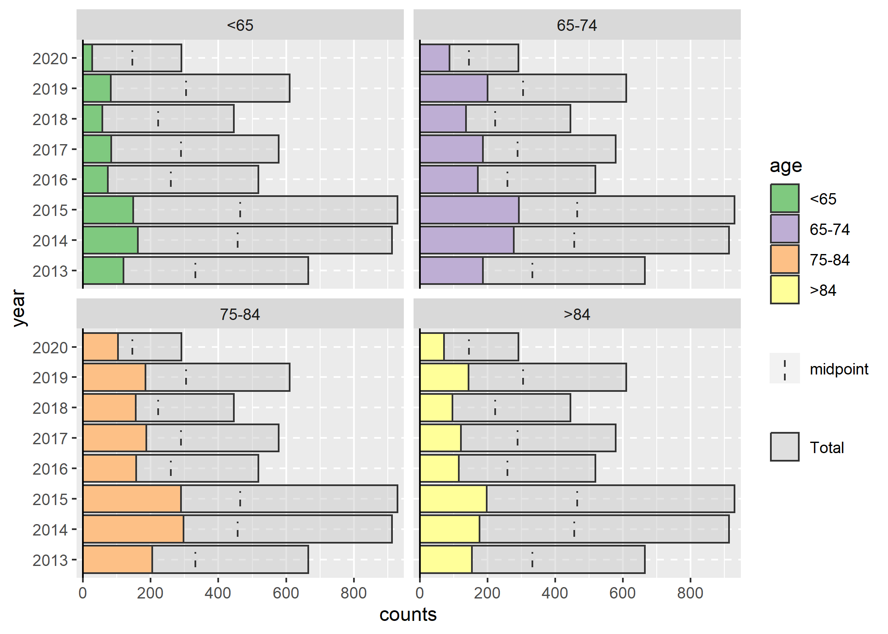

<!-- README.md is generated from README.Rmd. Please edit that file -->

# `provider` 

<!-- badges: start -->

[](https://github.com/andrewallenbruce/provider/actions/workflows/R-CMD-check.yaml)
[](https://lifecycle.r-lib.org/articles/stages.html#experimental)
[](https://www.repostatus.org/#wip)
[](https://choosealicense.com/licenses/mit/)
[](https://github.com/andrewallenbruce/provider)
[](https://github.com/andrewallenbruce/provider/commits/main)
[](https://app.codecov.io/gh/andrewallenbruce/provider?branch=main)
[](https://www.codefactor.io/repository/github/andrewallenbruce/provider)
<!-- badges: end -->

> Providing easy access to [healthcare
> provider](https://en.wikipedia.org/wiki/Health_care_provider)-centric
> data through publicly available APIs & sources.

<br>

## Installation

You can install the development version of `provider` from
[GitHub](https://github.com/) with:

``` r
# install.packages("devtools")
devtools::install_github("andrewallenbruce/provider")
```

``` r
# install.packages("remotes")
remotes::install_github("andrewallenbruce/provider")
```

| Function                   | API                                                                                                                                                                                                                                   |
|:---------------------------|:--------------------------------------------------------------------------------------------------------------------------------------------------------------------------------------------------------------------------------------|
| `addl_phone_numbers()`     | [Physician Additional Phone Numbers](https://data.cms.gov/provider-data/dataset/phys-phon)                                                                                                                                            |
| `beneficiary_enrollment()` | [Medicare Monthly Enrollment](https://data.cms.gov/summary-statistics-on-beneficiary-enrollment/medicare-and-medicaid-reports/medicare-monthly-enrollment)                                                                            |
| `cc_multiple()`            | [Medicare Multiple Chronic Conditions](https://data.cms.gov/medicare-chronic-conditions/multiple-chronic-conditions)                                                                                                                  |
| `cc_specific()`            | [Medicare Specific Chronic Conditions](https://data.cms.gov/medicare-chronic-conditions/specific-chronic-conditions)                                                                                                                  |
| `clia_labs()`              | [Medicare Provider of Services File - Clinical Laboratories](https://data.cms.gov/provider-characteristics/hospitals-and-other-facilities/provider-of-services-file-clinical-laboratories)                                            |
| `doctors_and_clinicians()` | [Doctors and Clinicians National Downloadable File](https://data.cms.gov/provider-data/dataset/mj5m-pzi6)                                                                                                                             |
| `facility_affiliations()`  | [CMS Physician Facility Affiliations](https://data.cms.gov/provider-data/dataset/27ea-46a8)                                                                                                                                           |
| `hospital_enrollment()`    | [Hospital Enrollments](https://data.cms.gov/provider-characteristics/hospitals-and-other-facilities/hospital-enrollments)                                                                                                             |
| `missing_information()`    | [CMS Public Reporting of Missing Digital Contact Information](https://data.cms.gov/provider-compliance/public-reporting-of-missing-digital-contact-information)                                                                       |
| `nppes_npi()`              | [NPPES National Provider Identifier (NPI) Registry](https://npiregistry.cms.hhs.gov/search)                                                                                                                                           |
| `open_payments()`          | [CMS Open Payments Program](https://openpaymentsdata.cms.gov/dataset/0380bbeb-aea1-58b6-b708-829f92a48202)                                                                                                                            |
| `opt_out()`                | [Medicare Opt Out Affidavits](https://data.cms.gov/provider-characteristics/medicare-provider-supplier-enrollment/opt-out-affidavits)                                                                                                 |
| `order_refer()`            | [Medicare Order and Referring](https://data.cms.gov/provider-characteristics/medicare-provider-supplier-enrollment/order-and-referring)                                                                                               |
| `pending_applications()`   | [Medicare Pending Initial Logging and Tracking](https://data.cms.gov/provider-characteristics/medicare-provider-supplier-enrollment/pending-initial-logging-and-tracking-physicians)                                                  |
| `physician_by_geography()` | [Medicare Physician & Other Practitioners: by Geography and Service](https://data.cms.gov/provider-summary-by-type-of-service/medicare-physician-other-practitioners/medicare-physician-other-practitioners-by-geography-and-service) |
| `physician_by_provider()`  | [Medicare Physician & Other Practitioners: by Provider](https://data.cms.gov/provider-summary-by-type-of-service/medicare-physician-other-practitioners/medicare-physician-other-practitioners-by-provider)                           |
| `physician_by_service()`   | [Medicare Physician & Other Practitioners: by Provider and Service](https://data.cms.gov/provider-summary-by-type-of-service/medicare-physician-other-practitioners/medicare-physician-other-practitioners-by-provider-and-service)   |
| `provider_enrollment()`    | [Medicare Fee-For-Service Public Provider Enrollment](https://data.cms.gov/provider-characteristics/medicare-provider-supplier-enrollment/medicare-fee-for-service-public-provider-enrollment)                                        |
| `revalidation_date()`      | [Medicare Revalidation Due Date](https://data.cms.gov/provider-characteristics/medicare-provider-supplier-enrollment/revalidation-due-date-list)                                                                                      |
| `revalidation_group()`     | [Medicare Revalidation Clinic Group Practice Reassignment](https://data.cms.gov/provider-characteristics/medicare-provider-supplier-enrollment/revalidation-clinic-group-practice-reassignment)                                       |
| `revalidation_reassign()`  | [Medicare Revalidation Reassignment](https://data.cms.gov/provider-characteristics/medicare-provider-supplier-enrollment/revalidation-reassignment-list)                                                                              |
| `taxonomy_crosswalk()`     | [Medicare Provider and Supplier Taxonomy Crosswalk](https://data.cms.gov/provider-characteristics/medicare-provider-supplier-enrollment/medicare-provider-and-supplier-taxonomy-crosswalk)                                            |

<br>

## Motivation

``` r
library(provider)
```

<br>

The goal of `provider` is to make the experience of getting location
data easier and more consistent across a wide variety of sources.

This package is primarily focused on accessing public API data that can
be linked together via a healthcare provider’s National Provider
Identifier (NPI). Thus far, none of the APIs require the creation of a
user account or API key. The data tend to fall into (and sometimes
between) one of two categories: informational/operational and
analytical. It only gets interesting when you start to link them
together.

<br>

## Information APIs

### NPPES NPI Registry

``` r
npi_1 <- provider::nppes_npi(npi = 1710975040) |> dplyr::rename(npi = number)
npi_1 |> dplyr::glimpse()
```

    #> Rows: 1
    #> Columns: 15
    #> $ datetime          <dttm> 2023-02-27 14:50:50
    #> $ outcome           <chr> "results"
    #> $ enumeration_type  <chr> "NPI-1"
    #> $ npi               <chr> "1710975040"
    #> $ name              <chr> "JOHN HERRING"
    #> $ city              <chr> "OLNEY"
    #> $ state             <chr> "MD"
    #> $ addresses         <list> [<data.frame[2 x 11]>]
    #> $ practiceLocations <list> []
    #> $ taxonomies        <list> [<data.frame[1 x 6]>]
    #> $ identifiers       <list> [<data.frame[5 x 5]>]
    #> $ endpoints         <list> []
    #> $ other_names       <list> []
    #> $ epochs            <list> [<tbl_df[1 x 2]>]
    #> $ basic             <list> [<tbl_df[1 x 11]>]

<br>

``` r
npi_1 |> 
  dplyr::select(enumeration_type:state) |> 
  provider:::display_long() |> 
  gluedown::md_table()
```

| name             | value        |
|:-----------------|:-------------|
| enumeration_type | NPI-1        |
| npi              | 1710975040   |
| name             | JOHN HERRING |
| city             | OLNEY        |
| state            | MD           |

<br>

> Basic Information

``` r
npi_1 |> 
  dplyr::select(basic) |> 
  tidyr::unnest(basic) |> 
  tidyr::pivot_longer(dplyr::everything()) |> 
  gluedown::md_table()
```

| name                   | value      |
|:-----------------------|:-----------|
| basic_first_name       | JOHN       |
| basic_last_name        | HERRING    |
| basic_middle_name      | E          |
| basic_credential       | MD         |
| basic_sole_proprietor  | NO         |
| basic_gender           | M          |
| basic_enumeration_date | 2005-10-11 |
| basic_last_updated     | 2007-07-08 |
| basic_status           | A          |
| basic_name_prefix      | –          |
| basic_name_suffix      | –          |

<br>

> Taxonomies

``` r
npi_1 |> 
  dplyr::select(taxonomies) |> 
  tidyr::unnest(taxonomies) |> 
  dplyr::mutate(dplyr::across(tidyselect::where(is.character), ~dplyr::na_if(., "")),
                    dplyr::across(tidyselect::where(is.character), ~dplyr::na_if(., "N/A"))) |> 
  dplyr::left_join(nucc_taxonomy_230, by = "code") |> 
  dplyr::select(!c(taxonomy_group, desc, specialization, definition, notes, display_name, section)) |> 
  provider:::display_long() |> 
  gluedown::md_table()
```

| name           | value                               |
|:---------------|:------------------------------------|
| code           | 207R00000X                          |
| state          | MD                                  |
| license        | D0030414                            |
| primary        | TRUE                                |
| grouping       | Allopathic & Osteopathic Physicians |
| classification | Internal Medicine                   |

<br>

> Addresses

``` r
npi_1 |> 
  dplyr::select(addresses) |> 
  tidyr::unnest(addresses) |> 
  tidyr::unite("address", 
               address_1:address_2, 
               remove = TRUE, 
               na.rm = TRUE, 
               sep = " ") |> 
  dplyr::mutate(telephone_number = campfin::normal_phone(telephone_number),
                fax_number = campfin::normal_phone(fax_number),
                postal_code = campfin::normal_zip(postal_code),
                address = campfin::normal_address(address)) |> 
  tidyr::pivot_longer(!address_purpose) |> 
  tidyr::pivot_wider(names_from = address_purpose, 
                     values_from = value) |> 
  gluedown::md_table()
```

| name             | MAILING                   | LOCATION               |
|:-----------------|:--------------------------|:-----------------------|
| country_code     | US                        | US                     |
| country_name     | United States             | United States          |
| address_type     | DOM                       | DOM                    |
| address          | 1300 PICCARD DR SUITE 202 | 18101 PRINCE PHILIP DR |
| city             | ROCKVILLE                 | OLNEY                  |
| state            | MD                        | MD                     |
| postal_code      | 20850                     | 20832                  |
| telephone_number | \(310\) 921-7900          | \(301\) 774-8900       |
| fax_number       | \(301\) 921-7915          | \(301\) 570-8574       |

<br>

> Identifiers

``` r
npi_1 |> 
  dplyr::select(identifiers) |> 
  tidyr::unnest(identifiers) |> 
  gluedown::md_table()
```

| code | desc                         | issuer    | identifier | state |
|:-----|:-----------------------------|:----------|:-----------|:------|
| 05   | MEDICAID                     | NA        | 367151800  | MD    |
| 01   | Other (non-Medicare)         | Carefirst | 367151810  | NA    |
| 04   | MEDICARE ID-Type Unspecified | NA        | 647145E14  | MD    |
| 04   | MEDICARE ID-Type Unspecified | NA        | 647145E14  | VA    |
| 02   | MEDICARE UPIN                | NA        | C59183     | NA    |

<br><br>

``` r
### Data frame of NPIs
npi_df <- data.frame(npi = c(1710983663,
                             1003026055,
                             1316405939,
                             1720392988,
                             1518184605,
                             1922056829,
                             1083879860,
                             1346243805,
                             1679576722,
                             1093718892,
                             1477556405,
                             1770586539,
                             1871596692,
                             1174526925, 
                             1720081441,
                             1558364273,
                             1801899513
                             ))
npi_df |>
  tibble::deframe() |> 
  as.list() |> 
  purrr::map(nppes_npi_new) |> 
  dplyr::bind_rows() |> 
  dplyr::mutate(certification_date = anytime::anydate(certification_date))
```

    #> # A tibble: 16 × 21
    #>    npi        enumer…¹ first…² last_…³ middl…⁴ crede…⁵ sole_…⁶ gender enumerat…⁷
    #>    <chr>      <chr>    <chr>   <chr>   <chr>   <chr>   <chr>   <chr>  <date>    
    #>  1 1003026055 NPI-1    RADHIKA PHADKE  PUSHKAR M.D, P… NO      F      2007-05-22
    #>  2 1316405939 NPI-1    JAENA   ABARZUA KAE     MC, LP… NO      F      2019-03-04
    #>  3 1720392988 NPI-1    MUSTAFA ABAS    <NA>    M.D.,   NO      M      2010-07-29
    #>  4 1518184605 NPI-1    DANIEL  AARON   LOUIS   M.D.    NO      M      2007-04-19
    #>  5 1922056829 NPI-1    CYNTHIA AARON   K       M.D.    NO      F      2006-05-04
    #>  6 1083879860 NPI-1    CHRIST… AARON   <NA>    <NA>    NO      M      2008-07-22
    #>  7 1346243805 NPI-1    HIE     KIM     C       M.D.    NO      M      2005-05-27
    #>  8 1679576722 NPI-1    DAVID   WIEBE   A       M.D.    NO      M      2005-05-23
    #>  9 1093718892 NPI-1    DINESH  GOYAL   K       MD      NO      M      2005-05-24
    #> 10 1477556405 NPI-1    CHARLES LINSEN… M       M.D.    NO      M      2005-05-23
    #> 11 1770586539 NPI-1    SUSAN   LANGEV… <NA>    MS, RD… NO      F      2005-05-24
    #> 12 1871596692 NPI-1    NOEMI   DOSOVA  S.      M.D.    NO      F      2005-05-24
    #> 13 1174526925 NPI-1    AKULA   KRISHNA V       M.D.    NO      M      2005-05-24
    #> 14 1720081441 NPI-1    KATHLE… STAUDI… M       MD      NO      F      2005-05-27
    #> 15 1558364273 NPI-1    JOHN    BAXTER  C       MD      NO      M      2005-05-27
    #> 16 1801899513 NPI-1    GEORGE  DAUWEL  C       d.c.    NO      M      2005-05-27
    #> # … with 12 more variables: last_updated <date>, status <chr>,
    #> #   name_prefix <chr>, name_suffix <chr>, taxonomies <list>,
    #> #   identifiers <list>, endpoints <list>, other_names <list>, addresses <list>,
    #> #   practice_locations <lgl>, enumeration_age <Duration>,
    #> #   certification_date <date>, and abbreviated variable names
    #> #   ¹​enumeration_type, ²​first_name, ³​last_name, ⁴​middle_name, ⁵​credential,
    #> #   ⁶​sole_proprietor, ⁷​enumeration_date

<br><br>

### CMS Physician Facility Affiliations

``` r
provider::facility_affiliations(npi = 1003019563) |> 
  dplyr::select(-record_number, -suff, -parent_ccn) |> 
  gluedown::md_table()
```

| npi        | ind_pac_id | lst_nm | frst_nm | mid_nm | facility_type | facility_afl_ccn |
|:-----------|:-----------|:-------|:--------|:-------|:--------------|:-----------------|
| 1003019563 | 4688707060 | FRANK  | JOHN    | JOSEPH | Hospital      | 060004           |
| 1003019563 | 4688707060 | FRANK  | JOHN    | JOSEPH | Hospital      | 060009           |
| 1003019563 | 4688707060 | FRANK  | JOHN    | JOSEPH | Hospital      | 060028           |
| 1003019563 | 4688707060 | FRANK  | JOHN    | JOSEPH | Hospital      | 060116           |

<br><br>

``` r
provider::facility_affiliations(facility_ccn = "060004") |> 
  dplyr::select(-record_number, -suff, -parent_ccn) |> 
  head(n = 25) |> 
  gluedown::md_table()
```

| npi        | ind_pac_id | lst_nm         | frst_nm  | mid_nm  | facility_type | facility_afl_ccn |
|:-----------|:-----------|:---------------|:---------|:--------|:--------------|:-----------------|
| 1003002890 | 6002953973 | HAMMAN         | DANIEL   | RICHARD | Hospital      | 060004           |
| 1003019563 | 4688707060 | FRANK          | JOHN     | JOSEPH  | Hospital      | 060004           |
| 1003045022 | 5890926059 | DONAHUE        | ARTHUR   | H       | Hospital      | 060004           |
| 1003105636 | 6507182847 | HIGHAM KESSLER | JAMES    | CHARLES | Hospital      | 060004           |
| 1003845249 | 1254326994 | WEINER         | GARETH   | R       | Hospital      | 060004           |
| 1003987124 | 5496905754 | KLIMA          | KATHRYN  | ANN     | Hospital      | 060004           |
| 1013069566 | 7810096328 | HELZER         | AMITY    | D       | Hospital      | 060004           |
| 1013115989 | 4385891712 | PYLE           | ASHLEY   | L       | Hospital      | 060004           |
| 1013979566 | 1557374014 | MUWALLA        | FIRAS    | NA      | Hospital      | 060004           |
| 1023261963 | 2860687431 | LUCCI          | CHAD     | MICHAEL | Hospital      | 060004           |
| 1023365244 | 4284851650 | MCARTHUR       | HADLEY   | J       | Hospital      | 060004           |
| 1033373410 | 6507902681 | FONTENOT       | JOHN     | C       | Hospital      | 060004           |
| 1053897264 | 4385994623 | BROOKS         | ERIN     | NA      | Hospital      | 060004           |
| 1063693646 | 8729208624 | PAN            | LORRAINE | Y       | Hospital      | 060004           |
| 1063964096 | 4183903958 | HAYES          | SUSAN    | E       | Hospital      | 060004           |
| 1073952412 | 2961796966 | JERANKO        | CHELSEA  | M       | Hospital      | 060004           |
| 1083097976 | 3375876626 | CHMIELECKI     | DAVID    | NA      | Hospital      | 060004           |
| 1083687362 | 3375435647 | RABOR          | DONALD   | A       | Hospital      | 060004           |
| 1093949620 | 8325279615 | MANGELSON      | JOHN     | J.      | Hospital      | 060004           |
| 1104224294 | 0648565150 | MCCOOL         | CANDICE  | NA      | Hospital      | 060004           |
| 1114345576 | 3476772997 | MCNITT         | WILLIAM  | C       | Hospital      | 060004           |
| 1114395688 | 7416379045 | VERAN-TAGUIBAO | SONIA    | GO      | Hospital      | 060004           |
| 1124332978 | 9931393535 | LEWIS          | KRISTINA | NA      | Hospital      | 060004           |
| 1124340583 | 3779612247 | OAKLEAF        | CAROL    | NA      | Hospital      | 060004           |
| 1134104227 | 1254224231 | GILLILAND      | J        | D       | Hospital      | 060004           |

<br><br>

``` r
provider::facility_affiliations(parent_ccn = 670055) |> 
  dplyr::select(-record_number, -suff, -parent_ccn) |> 
  gluedown::md_table()
```

| npi        | ind_pac_id | lst_nm     | frst_nm | mid_nm  | facility_type                     | facility_afl_ccn |
|:-----------|:-----------|:-----------|:--------|:--------|:----------------------------------|:-----------------|
| 1083742829 | 5698833655 | FORNARIS   | RAFAEL  | JORGE   | Inpatient rehabilitation facility | 67T055           |
| 1144429580 | 3577659580 | CURRY      | LYSA    | LEE     | Inpatient rehabilitation facility | 67T055           |
| 1386840197 | 3274620216 | HAU        | HORACIO | G       | Inpatient rehabilitation facility | 67T055           |
| 1427107028 | 1456328152 | CHANEY     | DENNIS  | M       | Inpatient rehabilitation facility | 67T055           |
| 1518985373 | 8628026861 | GUERRA     | ANTONIO | F       | Inpatient rehabilitation facility | 67T055           |
| 1558595660 | 8921241142 | ALFONSO    | JOHN    | D       | Inpatient rehabilitation facility | 67T055           |
| 1609973650 | 0840373239 | WILCOX     | GEORGE  | KIMBELL | Inpatient rehabilitation facility | 67T055           |
| 1710112370 | 9739337122 | VADDEMPUDI | VIDYA   | NA      | Inpatient rehabilitation facility | 67T055           |
| 1720069859 | 7012947229 | JANES      | WILLIAM | WARREN  | Inpatient rehabilitation facility | 67T055           |
| 1740577212 | 0345473773 | WEIKLE     | GEOFF   | R       | Inpatient rehabilitation facility | 67T055           |
| 1912260464 | 5092036509 | MANSOOR    | SAAD    | MD      | Inpatient rehabilitation facility | 67T055           |

<br><br>

``` r
provider::facility_affiliations(first_name = "John", 
                                last_name = "Hill", 
                                facility_type = "Home Health Agency") |> 
  dplyr::select(-record_number, -parent_ccn) |> 
  gluedown::md_table()
```

| npi        | ind_pac_id | lst_nm | frst_nm | mid_nm | suff | facility_type      | facility_afl_ccn |
|:-----------|:-----------|:-------|:--------|:-------|:-----|:-------------------|:-----------------|
| 1174587588 | 7214998079 | HILL   | JOHN    | C      | III  | Home health agency | 117021           |
| 1174587588 | 7214998079 | HILL   | JOHN    | C      | III  | Home health agency | 117036           |
| 1174587588 | 7214998079 | HILL   | JOHN    | C      | III  | Home health agency | 117069           |
| 1174587588 | 7214998079 | HILL   | JOHN    | C      | III  | Home health agency | 117125           |
| 1558380444 | 4789619362 | HILL   | JOHN    | M      | NA   | Home health agency | 107338           |
| 1558380444 | 4789619362 | HILL   | JOHN    | M      | NA   | Home health agency | 107408           |
| 1558380444 | 4789619362 | HILL   | JOHN    | M      | NA   | Home health agency | 107689           |
| 1558380444 | 4789619362 | HILL   | JOHN    | M      | NA   | Home health agency | 107707           |

<br><br>

### Hospital Enrollments

``` r
provider::hospital_enrollment(ccn = "060004") |> 
  tidyr::unite("address", address_line_1:address_line_2, 
               remove = TRUE, na.rm = TRUE, sep = " ") |> 
  dplyr::mutate(address = campfin::normal_address(address),
                zip_code = campfin::normal_zip(zip_code)) |> 
  provider:::display_long() |> 
  gluedown::md_table()
```

| name                         | value                                                 |
|:-----------------------------|:------------------------------------------------------|
| enrollment_id                | O20070619000323                                       |
| enrollment_state             | CO                                                    |
| provider_type_code           | 00-09                                                 |
| provider_type_text           | PART A PROVIDER - HOSPITAL                            |
| npi                          | 1629071758                                            |
| multiple_npi_flag            | FALSE                                                 |
| ccn                          | 060004                                                |
| associate_id                 | 1153213814                                            |
| organization_name            | BRIGHTON COMMUNITY HOSPITAL ASSOCIATION               |
| doing_business_as_name       | PLATTE VALLEY MEDICAL CENTER                          |
| incorporation_date           | 1958-08-18                                            |
| incorporation_state          | CO                                                    |
| organization_type_structure  | CORPORATION                                           |
| organization_other_type_text | NA                                                    |
| proprietary_nonprofit        | FALSE                                                 |
| address                      | 1600 PRAIRIE CENTER PKWY PLATTE VALLEY MEDICAL CENTER |
| city                         | BRIGHTON                                              |
| state                        | CO                                                    |
| zip_code                     | 80601                                                 |
| practice_location_type       | MAIN/PRIMARY HOSPITAL LOCATION                        |
| location_other_type_text     | NA                                                    |
| subgroup_general             | FALSE                                                 |
| subgroup_acute_care          | TRUE                                                  |
| subgroup_alcohol_drug        | FALSE                                                 |
| subgroup_childrens           | FALSE                                                 |
| subgroup_long_term           | FALSE                                                 |
| subgroup_psychiatric         | FALSE                                                 |
| subgroup_rehabilitation      | FALSE                                                 |
| subgroup_short_term          | FALSE                                                 |
| subgroup_swing_bed_approved  | FALSE                                                 |
| subgroup_psychiatric_unit    | FALSE                                                 |
| subgroup_rehabilitation_unit | FALSE                                                 |
| subgroup_specialty_hospital  | FALSE                                                 |
| subgroup_other               | FALSE                                                 |
| subgroup_other_text          | NA                                                    |

<br><br>

### CMS Doctors and Clinicians National File

``` r
dr_clin <- provider::doctors_and_clinicians(npi = 1407263999) |> 
  dplyr::select(!c(record_number, 
                   suff, 
                   cred, 
                   sec_spec_1:sec_spec_all, 
                   ln_2_sprs, adrs_id)) |> 
  tidyr::unite("address", 
               adr_ln_1:adr_ln_2, 
               remove = TRUE, 
               na.rm = TRUE, 
               sep = " ") |> 
  dplyr::mutate(phn_numbr = campfin::normal_phone(phn_numbr),
                zip = campfin::normal_zip(zip),
                address = campfin::normal_address(address))

dr_clin |> dplyr::glimpse()
```

    #> Rows: 2
    #> Columns: 21
    #> $ npi         <chr> "1407263999", "1407263999"
    #> $ ind_pac_id  <chr> "8729208152", "8729208152"
    #> $ ind_enrl_id <chr> "I20141006002245", "I20141006002245"
    #> $ lst_nm      <chr> "AVERY", "AVERY"
    #> $ frst_nm     <chr> "ROBIN", "ROBIN"
    #> $ mid_nm      <chr> "A", "A"
    #> $ gndr        <chr> "F", "F"
    #> $ med_sch     <chr> "OTHER", "OTHER"
    #> $ grd_yr      <chr> "1989", "1989"
    #> $ pri_spec    <chr> "CLINICAL PSYCHOLOGIST", "CLINICAL PSYCHOLOGIST"
    #> $ telehlth    <chr> "Y", "Y"
    #> $ org_nm      <chr> NA, "LARRY BROOKS, PH.D., LLC"
    #> $ org_pac_id  <chr> NA, "6608028899"
    #> $ num_org_mem <chr> NA, "2"
    #> $ address     <chr> "9999 NE 2ND AVE SUITE 209E", "3810 HOLLYWOOD BLVD SUITE 2"
    #> $ cty         <chr> "MIAMI SHORES", "HOLLYWOOD"
    #> $ st          <chr> "FL", "FL"
    #> $ zip         <chr> "33138", "33021"
    #> $ phn_numbr   <chr> NA, "(954) 962-3888"
    #> $ ind_assgn   <chr> "Y", "Y"
    #> $ grp_assgn   <chr> "M", "Y"

<br>

``` r
dr_clin |> 
  dplyr::slice_head() |> 
  provider:::display_long() |> 
  gluedown::md_table()
```

| name        | value                      |
|:------------|:---------------------------|
| npi         | 1407263999                 |
| ind_pac_id  | 8729208152                 |
| ind_enrl_id | I20141006002245            |
| lst_nm      | AVERY                      |
| frst_nm     | ROBIN                      |
| mid_nm      | A                          |
| gndr        | F                          |
| med_sch     | OTHER                      |
| grd_yr      | 1989                       |
| pri_spec    | CLINICAL PSYCHOLOGIST      |
| telehlth    | Y                          |
| org_nm      | NA                         |
| org_pac_id  | NA                         |
| num_org_mem | NA                         |
| address     | 9999 NE 2ND AVE SUITE 209E |
| cty         | MIAMI SHORES               |
| st          | FL                         |
| zip         | 33138                      |
| phn_numbr   | NA                         |
| ind_assgn   | Y                          |
| grp_assgn   | M                          |

<br>

``` r
dr_clin |> 
  dplyr::slice_tail() |> 
  provider:::display_long() |> 
  gluedown::md_table()
```

| name        | value                       |
|:------------|:----------------------------|
| npi         | 1407263999                  |
| ind_pac_id  | 8729208152                  |
| ind_enrl_id | I20141006002245             |
| lst_nm      | AVERY                       |
| frst_nm     | ROBIN                       |
| mid_nm      | A                           |
| gndr        | F                           |
| med_sch     | OTHER                       |
| grd_yr      | 1989                        |
| pri_spec    | CLINICAL PSYCHOLOGIST       |
| telehlth    | Y                           |
| org_nm      | LARRY BROOKS, PH.D., LLC    |
| org_pac_id  | 6608028899                  |
| num_org_mem | 2                           |
| address     | 3810 HOLLYWOOD BLVD SUITE 2 |
| cty         | HOLLYWOOD                   |
| st          | FL                          |
| zip         | 33021                       |
| phn_numbr   | \(954\) 962-3888            |
| ind_assgn   | Y                           |
| grp_assgn   | Y                           |

<br><br>

``` r
# search by medical school and/or graduation year
provider::doctors_and_clinicians(med_sch = "NEW YORK UNIVERSITY SCHOOL OF MEDICINE", 
                                 grad_year = 2003, 
                                 state = "FL") |> 
  dplyr::glimpse()
```

    #> Rows: 6
    #> Columns: 32
    #> $ record_number <chr> "2241611", "2241616", "4005191", "4586101", "6700176", "…
    #> $ npi           <chr> "1497955652", "1497955652", "1497955652", "1801000963", …
    #> $ ind_pac_id    <chr> "3476647330", "3476647330", "3476647330", "3577616598", …
    #> $ ind_enrl_id   <chr> "I20070922000027", "I20070922000027", "I20070922000027",…
    #> $ lst_nm        <chr> "CHIEN", "CHIEN", "CHIEN", "SCHETTINO", "GOLDBERG", "KAP…
    #> $ frst_nm       <chr> "YUI", "YUI", "YUI", "CHRIS", "BRIAN", "KEVIN"
    #> $ mid_nm        <chr> "F", "F", "F", "J", "KEITH", "M"
    #> $ suff          <chr> NA, NA, NA, NA, NA, NA
    #> $ gndr          <chr> "M", "M", "M", "M", "M", "M"
    #> $ cred          <chr> NA, NA, NA, NA, NA, NA
    #> $ med_sch       <chr> "NEW YORK UNIVERSITY SCHOOL OF MEDICINE", "NEW YORK UNIV…
    #> $ grd_yr        <chr> "2003", "2003", "2003", "2003", "2003", "2003"
    #> $ pri_spec      <chr> "OPHTHALMOLOGY", "OPHTHALMOLOGY", "OPHTHALMOLOGY", "PEDI…
    #> $ sec_spec_1    <chr> NA, NA, NA, "RADIATION ONCOLOGY", NA, "ORTHOPEDIC SURGER…
    #> $ sec_spec_2    <chr> NA, NA, NA, NA, NA, NA
    #> $ sec_spec_3    <chr> NA, NA, NA, NA, NA, NA
    #> $ sec_spec_4    <chr> NA, NA, NA, NA, NA, NA
    #> $ sec_spec_all  <chr> NA, NA, NA, "RADIATION ONCOLOGY", NA, "ORTHOPEDIC SURGER…
    #> $ telehlth      <chr> NA, NA, NA, NA, NA, NA
    #> $ org_nm        <chr> "EYE PHYSICIANS OF FLORIDA LLP", "EYE PHYSICIANS OF FLOR…
    #> $ org_pac_id    <chr> "1254414675", "1254414675", "2860553724", "3274795109", …
    #> $ num_org_mem   <chr> "49", "49", "3", "1646", "56", "111"
    #> $ adr_ln_1      <chr> "1 SW 129TH AVE", "8051 W SUNRISE BLVD", "1400 NE MIAMI …
    #> $ adr_ln_2      <chr> "209 CORRECTVISION LASER INSTITUTE LLC", NA, "SUITE 203"…
    #> $ ln_2_sprs     <chr> NA, NA, NA, NA, NA, NA
    #> $ cty           <chr> "PEMBROKE PINES", "PLANTATION", "NORTH MIAMI BEACH", "MI…
    #> $ st            <chr> "FL", "FL", "FL", "FL", "FL", "FL"
    #> $ zip           <chr> "330271717", "333224103", "331794844", "331361005", "347…
    #> $ phn_numbr     <chr> "9544421133", "9544742900", "3059401500", "3052434000", …
    #> $ ind_assgn     <chr> "Y", "Y", "Y", "Y", "Y", "Y"
    #> $ grp_assgn     <chr> "Y", "Y", "Y", "Y", "Y", "Y"
    #> $ adrs_id       <chr> "FL330271717PE1XXXXAVEX405", "FL333224103PL8051XBLVD400"…

<br><br>

### Additional Phone Numbers

``` r
provider::addl_phone_numbers(npi = 1407263999) |> 
  dplyr::select(prvdr_id, frst_nm, lst_nm, adr_ln_1, adr_ln_2:npi) |> 
  tidyr::unite("address", adr_ln_1:adr_ln_2, remove = TRUE, na.rm = TRUE, sep = " ") |> 
  dplyr::mutate(phn_numbr = campfin::normal_phone(phn_numbr),
                zip = campfin::normal_zip(zip),
                address = campfin::normal_address(address)) |> 
  gluedown::md_table()
```

| prvdr_id   | frst_nm | lst_nm | address                     | cty          | st  | zip   | org_pac_id | phn_numbr        | npi        |
|:-----------|:--------|:-------|:----------------------------|:-------------|:----|:------|:-----------|:-----------------|:-----------|
| 8729208152 | ROBIN   | AVERY  | 3810 HOLLYWOOD BLVD SUITE 2 | HOLLYWOOD    | FL  | 33021 | 6608028899 | \(954\) 962-3888 | 1407263999 |
| 8729208152 | ROBIN   | AVERY  | 9999 NE 2ND AVE SUITE 209E  | MIAMI SHORES | FL  | 33138 | NA         | \(786\) 615-4758 | 1407263999 |

<br><br>

``` r
addl_phone_numbers(provider_id = "0042100190") |> 
  dplyr::select(prvdr_id, frst_nm, lst_nm, adr_ln_1, adr_ln_2:npi) |> 
  tidyr::unite("address", adr_ln_1:adr_ln_2, remove = TRUE, na.rm = TRUE, sep = " ") |> 
  dplyr::mutate(phn_numbr = campfin::normal_phone(phn_numbr),
                zip = campfin::normal_zip(zip),
                address = campfin::normal_address(address)) |> 
  gluedown::md_table()
```

    #> Error in addl_phone_numbers(provider_id = "0042100190"): unused argument (provider_id = "0042100190")

<br><br>

``` r
addl_phone_numbers(org_pac_id = 6608028899) |> 
  dplyr::select(prvdr_id, frst_nm, lst_nm, adr_ln_1, adr_ln_2:npi) |> 
  tidyr::unite("address", adr_ln_1:adr_ln_2, remove = TRUE, na.rm = TRUE, sep = " ") |> 
  dplyr::mutate(phn_numbr = campfin::normal_phone(phn_numbr),
                zip = campfin::normal_zip(zip),
                address = campfin::normal_address(address)) |> 
  gluedown::md_table()
```

| prvdr_id   | frst_nm  | lst_nm | address                     | cty       | st  | zip   | org_pac_id | phn_numbr        | npi        |
|:-----------|:---------|:-------|:----------------------------|:----------|:----|:------|:-----------|:-----------------|:-----------|
| 3971798604 | LAWRENCE | BROOKS | 3810 HOLLYWOOD BLVD SUITE 2 | HOLLYWOOD | FL  | 33021 | 6608028899 | \(954\) 962-3888 | 1548577034 |
| 8729208152 | ROBIN    | AVERY  | 3810 HOLLYWOOD BLVD SUITE 2 | HOLLYWOOD | FL  | 33021 | 6608028899 | \(954\) 962-3888 | 1407263999 |

<br><br>

### CMS Missing Contact Information

``` r
provider::missing_information(npi = 1144224569) |> gluedown::md_table()
```

| npi        | last_name | first_name |
|:-----------|:----------|:-----------|
| 1144224569 | Clouse    | John       |

<br><br>

### Medicare Order and Referring

``` r
provider::order_refer(npi = 1083879860) |> gluedown::md_table()
```

|        npi | last_name | first_name  | partb | dme  | hha  | pmd  |
|-----------:|:----------|:------------|:------|:-----|:-----|:-----|
| 1083879860 | AARON     | CHRISTOPHER | TRUE  | TRUE | TRUE | TRUE |

<br><br>

### Medicare Opt-Out Affidavits

``` r
provider::opt_out(last_name = "Aaron") |> 
  tidyr::unite("address", first_line_street_address:second_line_street_address, 
               remove = TRUE, 
               na.rm = TRUE, 
               sep = " ") |> 
  dplyr::mutate(zip_code = campfin::normal_zip(zip_code),
                address = campfin::normal_address(address)) |> 
  provider:::display_long() |> 
  gluedown::md_table()
```

| name                        | value                  |
|:----------------------------|:-----------------------|
| first_name                  | Sheryl                 |
| last_name                   | Aaron                  |
| npi                         | 1427358282             |
| specialty                   | Clinical Social Worker |
| optout_effective_date       | 2022-02-17             |
| optout_end_date             | 2024-02-17             |
| address                     | 1633 Q ST NW STE 230   |
| city_name                   | WASHINGTON             |
| state_code                  | DC                     |
| zip_code                    | 20009                  |
| eligible_to_order_and_refer | FALSE                  |
| last_updated                | 2023-01-16             |

<br><br>

### Medicare Provider and Supplier Taxonomy Crosswalk

``` r
provider::taxonomy_crosswalk(specialty_desc = "Rehabilitation Agency") |> 
  dplyr::select(medicare_specialty_code, 
                medicare_specialty_description = medicare_provider_supplier_type_description,
                provider_taxonomy_code,
                provider_taxonomy_description = provider_taxonomy_description_type_classification_specialization) |> 
  gluedown::md_table()
```

| medicare_specialty_code | medicare_specialty_description | provider_taxonomy_code | provider_taxonomy_description                                  |
|:------------------------|:-------------------------------|:-----------------------|:---------------------------------------------------------------|
| B4\[14\]                | Rehabilitation Agency          | 261QR0400X             | Ambulatory Health Care Facilities/Clinic/Center Rehabilitation |
| B4\[14\]                | Rehabilitation Agency          | 315D00000X             | Nursing & Custodial Care Facilities/Hospice Inpatient          |

<br><br>

### Medicare Fee-For-Service Public Provider Enrollment

``` r
provider::provider_enrollment(npi = 1083879860) |> 
  provider:::display_long() |> 
  gluedown::md_table()
```

| name               | value                          |
|:-------------------|:-------------------------------|
| npi                | 1083879860                     |
| pecos_asct_cntl_id | 8426328519                     |
| enrlmt_id          | I20200617001010                |
| provider_type_cd   | 14-08                          |
| provider_type_desc | PRACTITIONER - FAMILY PRACTICE |
| state_cd           | PA                             |
| first_name         | CHRISTOPHER                    |
| mdl_name           | L                              |
| last_name          | AARON                          |
| org_name           | NA                             |
| gndr_sw            | M                              |

<br><br>

### Medicare Pending Initial Logging and Tracking

<br>

``` r
provider::pending_applications(npi = 1487003984, 
                               type = "physician") |> 
  gluedown::md_table()
```

| npi | last_name | first_name |
|:----|:----------|:-----------|
| NA  | NA        | NA         |

<br><br>

``` r
provider::pending_applications(npi = 1487003984, 
                               type = "non-physician") |> 
  gluedown::md_table()
```

| npi | last_name | first_name |
|:----|:----------|:-----------|
| NA  | NA        | NA         |

<br><br>

``` r
provider::pending_applications(last_name = "Abbott", 
                               type = "non-physician") |> 
  gluedown::md_table()
```

| npi | last_name | first_name |
|:----|:----------|:-----------|
| NA  | NA        | NA         |

<br><br>

``` r
pending_applications(first_name = "John", 
                     type = "physician") |> 
  gluedown::md_table()
```

| npi        | last_name     | first_name |
|:-----------|:--------------|:-----------|
| 1881791739 | ADAMS         | JOHN       |
| 1841280963 | BIGBEE        | JOHN       |
| 1619996378 | BODDEN        | JOHN       |
| 1588744569 | BRUNO         | JOHN       |
| 1861142556 | BURKE         | JOHN       |
| 1306817531 | COMBS         | JOHN       |
| 1730349580 | ECHEVARRIA    | JOHN       |
| 1982680997 | EVERED        | JOHN       |
| 1376571554 | FLYNN         | JOHN       |
| 1689774804 | FREEMAN       | JOHN       |
| 1386604080 | GIANNINI      | JOHN       |
| 1427395326 | HAGGERTY      | JOHN       |
| 1316239189 | HAMMONS       | JOHN       |
| 1407832538 | HELLRUNG      | JOHN       |
| 1649734195 | HILTON        | JOHN       |
| 1992799001 | HOLLINGSWORTH | JOHN       |
| 1407317084 | HURLEY        | JOHN       |
| 1710905674 | JONES         | JOHN       |
| 1679161996 | KLUBE         | JOHN       |
| 1851513428 | LOVEJOY III   | JOHN       |
| 1023000163 | LUDU          | JOHN       |
| 1144205394 | MAHANY        | JOHN       |
| 1053763698 | MARINO        | JOHN       |
| 1942307897 | MCGINNIS      | JOHN       |
| 1669506580 | MCKEON        | JOHN       |
| 1245970896 | MEISNER       | JOHN       |
| 1275596066 | MUNROE        | JOHN       |
| 1457370702 | PEDERSEN      | JOHN       |
| 1851715767 | PETTYGROVE    | JOHN       |
| 1568506368 | SMITH         | JOHN       |
| 1548823594 | SUTTER        | JOHN       |
| 1366437204 | VARENHOLT     | JOHN       |
| 1639191166 | VERVILLE      | JOHN       |

<br><br>

### Medicare Revalidation APIs

> Revalidation Due Date List

``` r
date <- provider::revalidation_date(npi = 1710912209)
date |> provider:::display_long() |> gluedown::md_table()
```

| name                            | value           |
|:--------------------------------|:----------------|
| enrollment_id                   | I20040602001711 |
| npi                             | 1710912209      |
| first_name                      | Yelena          |
| last_name                       | Voronova        |
| organization_name               | NA              |
| enrollment_state_code           | NY              |
| enrollment_type                 | 3               |
| provider_type_text              | Non-DME Part B  |
| enrollment_specialty            | Podiatry        |
| revalidation_due_date           | 2019-10-31      |
| adjusted_due_date               | NA              |
| individual_total_reassign_to    | NA              |
| receiving_benefits_reassignment | 5               |

<br><br>

> Revalidation Reassignment List

``` r
reassign <- provider::revalidation_reassign(ind_npi = 1710912209)
reassign |> dplyr::glimpse()
```

    #> Rows: 5
    #> Columns: 16
    #> $ group_pac_id                                 <dbl> 3678655222, 9931511052, 2…
    #> $ group_enrollment_id                          <chr> "O20080205000002", "O2020…
    #> $ group_legal_business_name                    <chr> "#1 Wise Podiatry Care P.…
    #> $ group_state_code                             <chr> "NY", "NY", "NY", "NY", "…
    #> $ group_due_date                               <chr> "10/31/2019", "TBD", "TBD…
    #> $ group_reassignments_and_physician_assistants <int> 1, 1, 1, 1, 1
    #> $ record_type                                  <chr> "Reassignment", "Reassign…
    #> $ individual_pac_id                            <dbl> 2860474988, 2860474988, 2…
    #> $ individual_enrollment_id                     <chr> "I20040602001711", "I2004…
    #> $ individual_npi                               <int> 1710912209, 1710912209, 1…
    #> $ individual_first_name                        <chr> "Yelena", "Yelena", "Yele…
    #> $ individual_last_name                         <chr> "Voronova", "Voronova", "…
    #> $ individual_state_code                        <chr> "NY", "NY", "NY", "NY", "…
    #> $ individual_specialty_description             <chr> "Podiatry", "Podiatry", "…
    #> $ individual_due_date                          <chr> "10/31/2019", "10/31/2019…
    #> $ individual_total_employer_associations       <int> 5, 5, 5, 5, 5

<br>

``` r
reassign |> 
  dplyr::select(dplyr::contains("individual")) |> 
  dplyr::slice_head() |> 
  provider:::display_long() |> 
  gluedown::md_table()
```

| name                                   | value           |
|:---------------------------------------|:----------------|
| individual_pac_id                      | 2860474988      |
| individual_enrollment_id               | I20040602001711 |
| individual_npi                         | 1710912209      |
| individual_first_name                  | Yelena          |
| individual_last_name                   | Voronova        |
| individual_state_code                  | NY              |
| individual_specialty_description       | Podiatry        |
| individual_due_date                    | 10/31/2019      |
| individual_total_employer_associations | 5               |

<br>

``` r
reassign |> 
  dplyr::select(dplyr::contains("group")) |> 
  provider:::display_long() |> 
  gluedown::md_table()
```

| name                                         | value                                           |
|:---------------------------------------------|:------------------------------------------------|
| group_pac_id                                 | 3678655222                                      |
| group_enrollment_id                          | O20080205000002                                 |
| group_legal_business_name                    | \#1 Wise Podiatry Care P.C.                     |
| group_state_code                             | NY                                              |
| group_due_date                               | 10/31/2019                                      |
| group_reassignments_and_physician_assistants | 1                                               |
| group_pac_id                                 | 9931511052                                      |
| group_enrollment_id                          | O20201215000955                                 |
| group_legal_business_name                    | Brighton Beach Podiatry Pllc                    |
| group_state_code                             | NY                                              |
| group_due_date                               | TBD                                             |
| group_reassignments_and_physician_assistants | 1                                               |
| group_pac_id                                 | 2062791411                                      |
| group_enrollment_id                          | O20161108001365                                 |
| group_legal_business_name                    | Fair Podiatry Practice Pllc                     |
| group_state_code                             | NY                                              |
| group_due_date                               | TBD                                             |
| group_reassignments_and_physician_assistants | 1                                               |
| group_pac_id                                 | 8527313170                                      |
| group_enrollment_id                          | O20180622000028                                 |
| group_legal_business_name                    | New York Jewish American Podiatry Practice Pllc |
| group_state_code                             | NY                                              |
| group_due_date                               | TBD                                             |
| group_reassignments_and_physician_assistants | 1                                               |
| group_pac_id                                 | 5193155174                                      |
| group_enrollment_id                          | O20200414003240                                 |
| group_legal_business_name                    | Podiatry Of Brooklyn Pllc                       |
| group_state_code                             | NY                                              |
| group_due_date                               | TBD                                             |
| group_reassignments_and_physician_assistants | 1                                               |

<br><br>

> Revalidation Clinic Group Practice Reassignment

``` r
group <- provider::revalidation_group(ind_npi = 1710912209)
group |> dplyr::glimpse()
```

    #> Rows: 5
    #> Columns: 15
    #> $ group_pac_id                                 <dbl> 3678655222, 9931511052, 2…
    #> $ group_enrollment_id                          <chr> "O20080205000002", "O2020…
    #> $ group_legal_business_name                    <chr> "#1 Wise Podiatry Care P.…
    #> $ group_state_code                             <chr> "NY", "NY", "NY", "NY", "…
    #> $ group_due_date                               <chr> "10/31/2019", "TBD", "TBD…
    #> $ group_reassignments_and_physician_assistants <int> 1, 1, 1, 1, 1
    #> $ record_type                                  <chr> "Reassignment", "Reassign…
    #> $ individual_enrollment_id                     <chr> "I20040602001711", "I2004…
    #> $ individual_npi                               <int> 1710912209, 1710912209, 1…
    #> $ individual_first_name                        <chr> "Yelena", "Yelena", "Yele…
    #> $ individual_last_name                         <chr> "Voronova", "Voronova", "…
    #> $ individual_state_code                        <chr> "NY", "NY", "NY", "NY", "…
    #> $ individual_specialty_description             <chr> "Podiatry", "Podiatry", "…
    #> $ individual_due_date                          <chr> "10/31/2019", "10/31/2019…
    #> $ individual_total_employer_associations       <int> 5, 5, 5, 5, 5

<br>

``` r
group |> 
  dplyr::select(dplyr::contains("individual")) |> 
  dplyr::slice_head() |> 
  provider:::display_long() |> 
  gluedown::md_table()
```

| name                                   | value           |
|:---------------------------------------|:----------------|
| individual_enrollment_id               | I20040602001711 |
| individual_npi                         | 1710912209      |
| individual_first_name                  | Yelena          |
| individual_last_name                   | Voronova        |
| individual_state_code                  | NY              |
| individual_specialty_description       | Podiatry        |
| individual_due_date                    | 10/31/2019      |
| individual_total_employer_associations | 5               |

``` r
group |> 
  dplyr::select(dplyr::contains("group")) |> 
  provider:::display_long() |> 
  gluedown::md_table()
```

| name                                         | value                                           |
|:---------------------------------------------|:------------------------------------------------|
| group_pac_id                                 | 3678655222                                      |
| group_enrollment_id                          | O20080205000002                                 |
| group_legal_business_name                    | \#1 Wise Podiatry Care P.C.                     |
| group_state_code                             | NY                                              |
| group_due_date                               | 10/31/2019                                      |
| group_reassignments_and_physician_assistants | 1                                               |
| group_pac_id                                 | 9931511052                                      |
| group_enrollment_id                          | O20201215000955                                 |
| group_legal_business_name                    | Brighton Beach Podiatry Pllc                    |
| group_state_code                             | NY                                              |
| group_due_date                               | TBD                                             |
| group_reassignments_and_physician_assistants | 1                                               |
| group_pac_id                                 | 2062791411                                      |
| group_enrollment_id                          | O20161108001365                                 |
| group_legal_business_name                    | Fair Podiatry Practice Pllc                     |
| group_state_code                             | NY                                              |
| group_due_date                               | TBD                                             |
| group_reassignments_and_physician_assistants | 1                                               |
| group_pac_id                                 | 8527313170                                      |
| group_enrollment_id                          | O20180622000028                                 |
| group_legal_business_name                    | New York Jewish American Podiatry Practice Pllc |
| group_state_code                             | NY                                              |
| group_due_date                               | TBD                                             |
| group_reassignments_and_physician_assistants | 1                                               |
| group_pac_id                                 | 5193155174                                      |
| group_enrollment_id                          | O20200414003240                                 |
| group_legal_business_name                    | Podiatry Of Brooklyn Pllc                       |
| group_state_code                             | NY                                              |
| group_due_date                               | TBD                                             |
| group_reassignments_and_physician_assistants | 1                                               |

<br><br>

## Analytical APIs

### CMS Open Payments API

``` r
op <- open_payments(recipient_npi = 1043218118)
op |> dplyr::glimpse()
```

    #> Rows: 92
    #> Columns: 92
    #> $ program_year                                                     <chr> "2021…
    #> $ record_number                                                    <chr> "1", …
    #> $ change_type                                                      <chr> "UNCH…
    #> $ covered_recipient_type                                           <chr> "Cove…
    #> $ teaching_hospital_ccn                                            <chr> NA, N…
    #> $ teaching_hospital_id                                             <chr> NA, N…
    #> $ teaching_hospital_name                                           <chr> NA, N…
    #> $ covered_recipient_profile_id                                     <chr> "9205…
    #> $ covered_recipient_npi                                            <chr> "1043…
    #> $ covered_recipient_first_name                                     <chr> "Ahad…
    #> $ covered_recipient_middle_name                                    <chr> NA, N…
    #> $ covered_recipient_last_name                                      <chr> "Maho…
    #> $ covered_recipient_name_suffix                                    <chr> NA, N…
    #> $ recipient_primary_business_street_address_line1                  <chr> "6739…
    #> $ recipient_primary_business_street_address_line2                  <chr> NA, N…
    #> $ recipient_city                                                   <chr> "Zeph…
    #> $ recipient_state                                                  <chr> "FL",…
    #> $ recipient_zip_code                                               <chr> "3354…
    #> $ recipient_country                                                <chr> "Unit…
    #> $ recipient_province                                               <chr> NA, N…
    #> $ recipient_postal_code                                            <chr> NA, N…
    #> $ covered_recipient_primary_type_1                                 <chr> "Medi…
    #> $ covered_recipient_primary_type_2                                 <chr> NA, N…
    #> $ covered_recipient_primary_type_3                                 <chr> NA, N…
    #> $ covered_recipient_primary_type_4                                 <chr> NA, N…
    #> $ covered_recipient_primary_type_5                                 <chr> NA, N…
    #> $ covered_recipient_primary_type_6                                 <chr> NA, N…
    #> $ covered_recipient_specialty_1                                    <chr> "Allo…
    #> $ covered_recipient_specialty_2                                    <chr> NA, N…
    #> $ covered_recipient_specialty_3                                    <chr> NA, N…
    #> $ covered_recipient_specialty_4                                    <chr> NA, N…
    #> $ covered_recipient_specialty_5                                    <chr> NA, N…
    #> $ covered_recipient_specialty_6                                    <chr> NA, N…
    #> $ covered_recipient_license_state_code1                            <chr> "FL",…
    #> $ covered_recipient_license_state_code2                            <chr> NA, N…
    #> $ covered_recipient_license_state_code3                            <chr> NA, N…
    #> $ covered_recipient_license_state_code4                            <chr> NA, N…
    #> $ covered_recipient_license_state_code5                            <chr> NA, N…
    #> $ submitting_applicable_manufacturer_or_applicable_gpo_name        <chr> "Mobi…
    #> $ applicable_manufacturer_or_applicable_gpo_making_payment_id      <chr> "1000…
    #> $ applicable_manufacturer_or_applicable_gpo_making_payment_name    <chr> "Mobi…
    #> $ applicable_manufacturer_or_applicable_gpo_making_payment_state   <chr> "MO",…
    #> $ applicable_manufacturer_or_applicable_gpo_making_payment_country <chr> "Unit…
    #> $ total_amount_of_payment_usdollars                                <dbl> 2500.…
    #> $ date_of_payment                                                  <dttm> 2021…
    #> $ number_of_payments_included_in_total_amount                      <chr> "1", …
    #> $ form_of_payment_or_transfer_of_value                             <chr> "Cash…
    #> $ nature_of_payment_or_transfer_of_value                           <chr> "Comp…
    #> $ city_of_travel                                                   <chr> NA, N…
    #> $ state_of_travel                                                  <chr> NA, N…
    #> $ country_of_travel                                                <chr> NA, N…
    #> $ physician_ownership_indicator                                    <chr> "No",…
    #> $ third_party_payment_recipient_indicator                          <chr> "No T…
    #> $ name_of_third_party_entity_receiving_payment_or_transfer_of_ccfc <chr> NA, N…
    #> $ charity_indicator                                                <chr> "No",…
    #> $ third_party_equals_covered_recipient_indicator                   <chr> NA, N…
    #> $ contextual_information                                           <chr> NA, N…
    #> $ delay_in_publication_indicator                                   <chr> "No",…
    #> $ record_id                                                        <chr> "7549…
    #> $ dispute_status_for_publication                                   <chr> "No",…
    #> $ related_product_indicator                                        <chr> "Yes"…
    #> $ covered_or_noncovered_indicator_1                                <chr> "Cove…
    #> $ indicate_drug_or_biological_or_device_or_medical_supply_1        <chr> "Drug…
    #> $ product_category_or_therapeutic_area_1                           <chr> "Opht…
    #> $ name_of_drug_or_biological_or_device_or_medical_supply_1         <chr> "Mito…
    #> $ associated_drug_or_biological_ndc_1                              <chr> "4977…
    #> $ associated_device_or_medical_supply_pdi_1                        <chr> NA, "…
    #> $ covered_or_noncovered_indicator_2                                <chr> NA, N…
    #> $ indicate_drug_or_biological_or_device_or_medical_supply_2        <chr> NA, N…
    #> $ product_category_or_therapeutic_area_2                           <chr> NA, N…
    #> $ name_of_drug_or_biological_or_device_or_medical_supply_2         <chr> NA, N…
    #> $ associated_drug_or_biological_ndc_2                              <chr> NA, N…
    #> $ associated_device_or_medical_supply_pdi_2                        <chr> NA, N…
    #> $ covered_or_noncovered_indicator_3                                <chr> NA, N…
    #> $ indicate_drug_or_biological_or_device_or_medical_supply_3        <chr> NA, N…
    #> $ product_category_or_therapeutic_area_3                           <chr> NA, N…
    #> $ name_of_drug_or_biological_or_device_or_medical_supply_3         <chr> NA, N…
    #> $ associated_drug_or_biological_ndc_3                              <chr> NA, N…
    #> $ associated_device_or_medical_supply_pdi_3                        <chr> NA, N…
    #> $ covered_or_noncovered_indicator_4                                <chr> NA, N…
    #> $ indicate_drug_or_biological_or_device_or_medical_supply_4        <chr> NA, N…
    #> $ product_category_or_therapeutic_area_4                           <chr> NA, N…
    #> $ name_of_drug_or_biological_or_device_or_medical_supply_4         <chr> NA, N…
    #> $ associated_drug_or_biological_ndc_4                              <chr> NA, N…
    #> $ associated_device_or_medical_supply_pdi_4                        <chr> NA, N…
    #> $ covered_or_noncovered_indicator_5                                <chr> NA, N…
    #> $ indicate_drug_or_biological_or_device_or_medical_supply_5        <chr> NA, N…
    #> $ product_category_or_therapeutic_area_5                           <chr> NA, N…
    #> $ name_of_drug_or_biological_or_device_or_medical_supply_5         <chr> NA, N…
    #> $ associated_drug_or_biological_ndc_5                              <chr> NA, N…
    #> $ associated_device_or_medical_supply_pdi_5                        <chr> NA, N…
    #> $ payment_publication_date                                         <dttm> 2023…

<br>

``` r
op |> 
  tidyr::hoist(covered_recipient, 
               recipient_npi = "covered_recipient_npi",
               profile_id = "covered_recipient_profile_id",
               first_name = "covered_recipient_first_name", 
               last_name = "covered_recipient_last_name",
               credential = "covered_recipient_primary_type_1",) |> 
  tidyr::hoist(recipient_address, 
               city = "recipient_city", 
               state = "recipient_state") |> 
  dplyr::select(program_year, 
                recipient_npi, 
                profile_id,
                first_name,
                last_name,
                credential,
                city,
                state) |> 
  dplyr::slice_head() |>
  provider:::display_long() |> 
  gluedown::md_table()
```

    #> Error in `tidyr::hoist()`:
    #> Caused by error:
    #> ! object 'covered_recipient' not found

<br>

``` r
op_2 <- op |> 
  tidyr::hoist(applicable_mfg_gpo, 
               manufacturer_gpo_paying = "applicable_manufacturer_or_applicable_gpo_making_payment_name") |>
  tidyr::hoist(associated_drug_device, 
               type = "indicate_drug_or_biological_or_device_or_medical_supply_1",
               therapeutic_category = "product_category_or_therapeutic_area_1",
               name = "name_of_drug_or_biological_or_device_or_medical_supply_1") |> 
  dplyr::select(payment_date = date_of_payment, 
                manufacturer_gpo_paying,
                type, 
                name,
                therapeutic_category,
                payment_total = total_amount_of_payment_usdollars,
                nature_of_payment = nature_of_payment_or_transfer_of_value) |> 
  dplyr::arrange(payment_date)
```

    #> Error in `tidyr::hoist()`:
    #> Caused by error:
    #> ! object 'applicable_mfg_gpo' not found

``` r
op_2 |> 
  dplyr::group_by(manufacturer_gpo_paying, 
                  nature_of_payment, 
                  name) |> 
  dplyr::summarise(n = dplyr::n(),
                   payment_total = sum(payment_total), 
                   .groups = "drop") |> 
  dplyr::mutate(nature_of_payment = stringr::str_trunc(nature_of_payment, 20, "right")) |> 
  dplyr::arrange(dplyr::desc(payment_total)) |> 
  gluedown::md_table()
```

    #> Error in dplyr::group_by(op_2, manufacturer_gpo_paying, nature_of_payment, : object 'op_2' not found

<br><br>

### Medicare Monthly Enrollment API

``` r
months <- tibble::enframe(month.name) |> 
  dplyr::select(-name) |> 
  dplyr::slice(1:7) |> 
  tibble::deframe()

bene <- purrr::map_dfr(months, ~beneficiary_enrollment(year = 2022, 
                                                       geo_level = "State", 
                                                       state = "Georgia", 
                                                       month = .x))

bene |> dplyr::glimpse()
```

    #> Rows: 7
    #> Columns: 22
    #> $ year                           <int> 2022, 2022, 2022, 2022, 2022, 2022, 2022
    #> $ month                          <chr> "January", "February", "March", "April"…
    #> $ bene_geo_lvl                   <chr> "State", "State", "State", "State", "St…
    #> $ bene_state_abrvtn              <chr> "GA", "GA", "GA", "GA", "GA", "GA", "GA"
    #> $ bene_state_desc                <chr> "Georgia", "Georgia", "Georgia", "Georg…
    #> $ bene_county_desc               <chr> "Total", "Total", "Total", "Total", "To…
    #> $ bene_fips_cd                   <chr> "13", "13", "13", "13", "13", "13", "13"
    #> $ tot_benes                      <int> 1830959, 1830025, 1831573, 1833135, 183…
    #> $ orgnl_mdcr_benes               <int> 915752, 913347, 912897, 911263, 910417,…
    #> $ ma_and_oth_benes               <int> 915207, 916678, 918676, 921872, 924770,…
    #> $ aged_tot_benes                 <int> 1572257, 1571050, 1572037, 1573058, 157…
    #> $ aged_esrd_benes                <int> 11635, 11312, 11096, 10888, 10716, 1052…
    #> $ aged_no_esrd_benes             <int> 1560622, 1559738, 1560941, 1562170, 156…
    #> $ dsbld_tot_benes                <int> 258702, 258975, 259536, 260077, 260617,…
    #> $ dsbld_esrd_and_esrd_only_benes <int> 12011, 11905, 11853, 11835, 11827, 1179…
    #> $ dsbld_no_esrd_benes            <int> 246691, 247070, 247683, 248242, 248790,…
    #> $ a_b_tot_benes                  <int> 1681852, 1680770, 1681852, 1683513, 168…
    #> $ a_b_orgnl_mdcr_benes           <int> 767454, 764903, 763986, 762450, 761518,…
    #> $ a_b_ma_and_oth_benes           <int> 914398, 915867, 917866, 921063, 923961,…
    #> $ prscrptn_drug_tot_benes        <int> 1410752, 1410748, 1411729, 1413507, 141…
    #> $ prscrptn_drug_pdp_benes        <int> 538559, 536815, 535968, 534687, 534006,…
    #> $ prscrptn_drug_mapd_benes       <int> 872193, 873933, 875761, 878820, 881515,…

<br>

``` r
bene |> 
  dplyr::select(state = bene_state_abrvtn,
                month, 
                tot_benes, 
                orgnl_mdcr_benes, 
                ma_and_oth_benes) |> 
  dplyr::mutate(tot_change = tot_benes - dplyr::lag(tot_benes), .after = tot_benes) |>  
  dplyr::mutate(orig_pct = round(orgnl_mdcr_benes / tot_benes, 2),
                ma_other_pct = round(ma_and_oth_benes / tot_benes, 2)) |> 
  gluedown::md_table()
```

| state | month    | tot_benes | tot_change | orgnl_mdcr_benes | ma_and_oth_benes | orig_pct | ma_other_pct |
|:------|:---------|----------:|-----------:|-----------------:|-----------------:|---------:|-------------:|
| GA    | January  |   1830959 |         NA |           915752 |           915207 |     0.50 |         0.50 |
| GA    | February |   1830025 |       -934 |           913347 |           916678 |     0.50 |         0.50 |
| GA    | March    |   1831573 |       1548 |           912897 |           918676 |     0.50 |         0.50 |
| GA    | April    |   1833135 |       1562 |           911263 |           921872 |     0.50 |         0.50 |
| GA    | May      |   1835187 |       2052 |           910417 |           924770 |     0.50 |         0.50 |
| GA    | June     |   1837394 |       2207 |           909778 |           927616 |     0.50 |         0.50 |
| GA    | July     |   1840128 |       2734 |           907070 |           933058 |     0.49 |         0.51 |

<br>

``` r
bene |> 
  dplyr::select(state = bene_state_abrvtn,
                month, 
                tot_benes, 
                aged_tot_benes,
                aged_esrd_benes,
                aged_no_esrd_benes) |> 
  dplyr::mutate(aged_pct_of_tot = round(aged_tot_benes / tot_benes, 2), .after = aged_tot_benes) |> 
  dplyr::mutate(esrd_pct_of_aged = round(aged_esrd_benes / aged_tot_benes, 2), .after = aged_esrd_benes) |> 
  gluedown::md_table()
```

| state | month    | tot_benes | aged_tot_benes | aged_pct_of_tot | aged_esrd_benes | esrd_pct_of_aged | aged_no_esrd_benes |
|:------|:---------|----------:|---------------:|----------------:|----------------:|-----------------:|-------------------:|
| GA    | January  |   1830959 |        1572257 |            0.86 |           11635 |             0.01 |            1560622 |
| GA    | February |   1830025 |        1571050 |            0.86 |           11312 |             0.01 |            1559738 |
| GA    | March    |   1831573 |        1572037 |            0.86 |           11096 |             0.01 |            1560941 |
| GA    | April    |   1833135 |        1573058 |            0.86 |           10888 |             0.01 |            1562170 |
| GA    | May      |   1835187 |        1574570 |            0.86 |           10716 |             0.01 |            1563854 |
| GA    | June     |   1837394 |        1575954 |            0.86 |           10525 |             0.01 |            1565429 |
| GA    | July     |   1840128 |        1578129 |            0.86 |           10368 |             0.01 |            1567761 |

<br>

``` r
bene |> 
  dplyr::select(month, 
                tot_benes,
                tot_orig = orgnl_mdcr_benes, 
                tot_ma_oth = ma_and_oth_benes,
                ab_tot = a_b_tot_benes,
                ab_orig = a_b_orgnl_mdcr_benes,
                ab_ma_oth = a_b_ma_and_oth_benes) |> 
  dplyr::mutate(tot_check = tot_orig + tot_ma_oth, .after = tot_benes) |> 
  dplyr::mutate(ab_tot_check = ab_orig + ab_ma_oth, .after = ab_tot) |> 
  dplyr::mutate(tot_ab_diff = tot_benes - ab_tot) |> 
  gluedown::md_table()
```

| month    | tot_benes | tot_check | tot_orig | tot_ma_oth |  ab_tot | ab_tot_check | ab_orig | ab_ma_oth | tot_ab_diff |
|:---------|----------:|----------:|---------:|-----------:|--------:|-------------:|--------:|----------:|------------:|
| January  |   1830959 |   1830959 |   915752 |     915207 | 1681852 |      1681852 |  767454 |    914398 |      149107 |
| February |   1830025 |   1830025 |   913347 |     916678 | 1680770 |      1680770 |  764903 |    915867 |      149255 |
| March    |   1831573 |   1831573 |   912897 |     918676 | 1681852 |      1681852 |  763986 |    917866 |      149721 |
| April    |   1833135 |   1833135 |   911263 |     921872 | 1683513 |      1683513 |  762450 |    921063 |      149622 |
| May      |   1835187 |   1835187 |   910417 |     924770 | 1685479 |      1685479 |  761518 |    923961 |      149708 |
| June     |   1837394 |   1837394 |   909778 |     927616 | 1687818 |      1687818 |  761012 |    926806 |      149576 |
| July     |   1840128 |   1840128 |   907070 |     933058 | 1696372 |      1696372 |  764122 |    932250 |      143756 |

<br><br>

### Medicare Physician & Other Practitioners APIs

<br>

> 1.  by Provider and Service:

<br>

``` r
pbs <- purrr::map_dfr(2013:2020, ~physician_by_service(npi = 1003000126, year = .x))
pbs |> dplyr::glimpse()
```

    #> Rows: 8
    #> Columns: 6
    #> $ year         <int> 2013, 2014, 2015, 2016, 2017, 2018, 2019, 2020
    #> $ rndrng_npi   <chr> "1003000126", "1003000126", "1003000126", "1003000126", "…
    #> $ rndrng_prvdr <list> [<tbl_df[7 x 17]>], [<tbl_df[8 x 17]>], [<tbl_df[11 x 17]…
    #> $ totals_srvcs <list> [<tbl_df[7 x 3]>], [<tbl_df[8 x 3]>], [<tbl_df[11 x 3]>]…
    #> $ hcpcs        <list> [<tbl_df[7 x 4]>], [<tbl_df[8 x 4]>], [<tbl_df[11 x 4]>]…
    #> $ averages     <list> [<tbl_df[7 x 4]>], [<tbl_df[8 x 4]>], [<tbl_df[11 x 4]>]…

<br>

``` r
pbs |> 
  dplyr::select(rndrng_prvdr) |> 
  tidyr::unnest(rndrng_prvdr) |> 
  dplyr::slice_head() |> 
  provider:::display_long() |> 
  gluedown::md_table()
```

| name                          | value                                                                               |
|:------------------------------|:------------------------------------------------------------------------------------|
| rndrng_prvdr_last_org_name    | Enkeshafi                                                                           |
| rndrng_prvdr_first_name       | Ardalan                                                                             |
| rndrng_prvdr_mi               | NA                                                                                  |
| rndrng_prvdr_crdntls          | M.D.                                                                                |
| rndrng_prvdr_gndr             | M                                                                                   |
| rndrng_prvdr_ent_cd           | I                                                                                   |
| rndrng_prvdr_st1              | 900 Seton Dr                                                                        |
| rndrng_prvdr_st2              | NA                                                                                  |
| rndrng_prvdr_city             | Cumberland                                                                          |
| rndrng_prvdr_state_abrvtn     | MD                                                                                  |
| rndrng_prvdr_state_fips       | 24                                                                                  |
| rndrng_prvdr_zip5             | 21502                                                                               |
| rndrng_prvdr_ruca             | 1                                                                                   |
| rndrng_prvdr_ruca_desc        | Metropolitan area core: primary flow within an urbanized area of 50,000 and greater |
| rndrng_prvdr_cntry            | US                                                                                  |
| rndrng_prvdr_type             | Internal Medicine                                                                   |
| rndrng_prvdr_mdcr_prtcptg_ind | Y                                                                                   |

<br>

``` r
pbs |> 
  dplyr::select(year, totals_srvcs, hcpcs, averages) |> 
  tidyr::unnest(c(totals_srvcs, hcpcs, averages)) |> 
  dplyr::select(!c(hcpcs_desc:place_of_srvc, tot_bene_day_srvcs, avg_mdcr_stdzd_amt)) |> 
  dplyr::arrange(dplyr::desc(year), dplyr::desc(tot_srvcs)) |> 
  gluedown::md_table()
```

| year | tot_benes | tot_srvcs | hcpcs_cd | avg_sbmtd_chrg | avg_mdcr_alowd_amt | avg_mdcr_pymt_amt |
|-----:|----------:|----------:|:---------|---------------:|-------------------:|------------------:|
| 2020 |       154 |       326 | 99233    |       513.2117 |          108.84687 |          88.94589 |
| 2020 |       145 |       146 | 99239    |       491.8699 |          111.25979 |          90.92384 |
| 2020 |        57 |       134 | 99232    |       251.3284 |           73.45470 |          57.95582 |
| 2020 |        52 |        52 | 99223    |      1108.3846 |          209.42385 |         170.83462 |
| 2020 |        23 |        23 | 99217    |       406.1739 |           76.80391 |          61.40174 |
| 2020 |        16 |        16 | 99218    |       811.8125 |          108.24938 |          85.08125 |
| 2020 |        16 |        16 | 99220    |      1150.9375 |          191.96062 |         152.37688 |
| 2020 |        13 |        13 | 99238    |       268.4615 |           74.15769 |          60.53308 |
| 2020 |        12 |        12 | 99221    |       681.6667 |          110.04750 |          82.23750 |
| 2019 |       306 |       605 | 99233    |       345.2364 |          103.58820 |          82.58817 |
| 2019 |       240 |       243 | 99239    |       349.2593 |          106.54309 |          84.96992 |
| 2019 |       117 |       205 | 99232    |       245.6146 |           72.75639 |          58.00556 |
| 2019 |       157 |       158 | 99223    |       651.4177 |          200.93000 |         160.19000 |
| 2019 |        40 |        40 | 99217    |       232.2750 |           72.59000 |          57.87000 |
| 2019 |        39 |        40 | 99238    |       229.4750 |           72.59000 |          57.87000 |
| 2019 |        21 |        27 | 99291    |       701.4444 |          221.27000 |         176.40000 |
| 2019 |        25 |        25 | 99220    |       712.8000 |          186.72520 |         148.85160 |
| 2019 |        24 |        24 | 99221    |       320.1667 |          101.12125 |          80.61583 |
| 2018 |       206 |       360 | 99232    |       360.5722 |           72.38542 |          57.67031 |
| 2018 |       148 |       284 | 99233    |       576.9894 |          103.66095 |          82.51299 |
| 2018 |       217 |       250 | 99239    |       555.6400 |          106.73396 |          85.03664 |
| 2018 |        82 |        86 | 99223    |      1093.5000 |          199.75721 |         159.25907 |
| 2018 |        67 |        68 | 99217    |       381.3088 |           72.64103 |          57.88029 |
| 2018 |        30 |        42 | 99291    |      1400.0000 |          215.74119 |         171.89333 |
| 2018 |        26 |        26 | 99220    |      1086.9231 |          185.10154 |         147.47923 |
| 2018 |        24 |        24 | 99221    |       474.5833 |          100.60125 |          80.15500 |
| 2018 |        19 |        19 | 99218    |       476.9474 |           99.31158 |          76.79526 |
| 2018 |        17 |        17 | 99222    |       625.0000 |          135.83647 |         108.22529 |
| 2018 |        16 |        16 | 99238    |       415.3125 |           72.66688 |          57.90125 |
| 2017 |       233 |       627 | 99232    |       326.2456 |           71.24051 |          56.36673 |
| 2017 |       291 |       341 | 99239    |       481.6862 |          106.32874 |          84.05616 |
| 2017 |       127 |       207 | 99233    |       461.0725 |          103.94768 |          82.82068 |
| 2017 |       110 |       114 | 99223    |       923.9912 |          202.79219 |         160.37719 |
| 2017 |        96 |       100 | 99217    |       325.7800 |           71.96390 |          56.82720 |
| 2017 |        59 |        59 | 99220    |       755.9322 |          184.32203 |         141.29356 |
| 2017 |        57 |        59 | 99222    |       625.0000 |          135.14729 |         105.82542 |
| 2017 |        51 |        52 | 99219    |       614.0000 |          134.28385 |         102.80769 |
| 2017 |        23 |        36 | 99291    |      1400.0000 |          220.58000 |         175.75000 |
| 2017 |        25 |        26 | 99218    |       449.0000 |           98.48000 |          78.46000 |
| 2017 |        16 |        16 | 99221    |       462.8125 |          100.05000 |          79.71000 |
| 2016 |       270 |       596 | 99232    |       326.4866 |           70.71562 |          56.21099 |
| 2016 |       231 |       271 | 99239    |       485.0000 |          105.05000 |          83.70000 |
| 2016 |       141 |       148 | 99223    |       920.6149 |          200.54466 |         159.08345 |
| 2016 |        85 |       117 | 99233    |       470.0000 |          101.88538 |          80.90932 |
| 2016 |        87 |        96 | 99222    |       625.0000 |          134.09740 |         105.47760 |
| 2016 |        55 |        57 | 99217    |       325.1579 |           70.79825 |          54.47439 |
| 2016 |        26 |        53 | 99291    |      1400.0000 |          219.04000 |         174.52000 |
| 2016 |        38 |        38 | 99219    |       614.0000 |          132.85000 |         105.85000 |
| 2016 |        23 |        23 | 99220    |       769.3478 |          186.25913 |         146.11652 |
| 2016 |        20 |        20 | 99221    |       460.0000 |           99.14000 |          78.99000 |
| 2016 |        20 |        20 | 99238    |       328.0000 |           71.04550 |          52.83150 |
| 2016 |        11 |        11 | 99225    |       328.0000 |           71.32000 |          56.82000 |
| 2015 |       481 |      1117 | 99232    |       200.9320 |           71.87013 |          56.31386 |
| 2015 |       286 |       580 | 99233    |       301.9810 |          101.51336 |          80.92938 |
| 2015 |       353 |       368 | 99239    |       308.3016 |          106.55685 |          83.94720 |
| 2015 |       215 |       220 | 99223    |       631.1864 |          199.45268 |         157.90895 |
| 2015 |       172 |       175 | 99238    |       210.8800 |           72.46834 |          57.07949 |
| 2015 |       130 |       132 | 99222    |       356.4924 |          136.80970 |         107.93341 |
| 2015 |        58 |        59 | 99221    |       333.2881 |           99.74085 |          79.46966 |
| 2015 |        18 |        38 | 99231    |       100.8421 |           38.92474 |          31.01579 |
| 2015 |        23 |        23 | 99217    |       328.0000 |           71.57043 |          54.50261 |
| 2015 |        13 |        21 | 99291    |       633.8095 |          223.42190 |         178.01190 |
| 2015 |        18 |        18 | 99219    |       614.0000 |          133.79333 |         100.95889 |
| 2014 |       596 |      1418 | 99232    |       217.0000 |           71.69861 |          56.29776 |
| 2014 |       341 |       357 | 99222    |       416.5462 |          137.74919 |         107.51787 |
| 2014 |       316 |       330 | 99238    |       217.0000 |           72.37955 |          55.68124 |
| 2014 |       215 |       223 | 99239    |       322.0000 |          106.37072 |          83.70637 |
| 2014 |       104 |       175 | 99233    |       312.0000 |          103.83000 |          82.39817 |
| 2014 |        65 |       104 | 99231    |       119.0000 |           39.08673 |          30.83538 |
| 2014 |        98 |        98 | 99223    |       611.0000 |          201.09684 |         152.55122 |
| 2014 |        13 |        23 | 99291    |       674.0000 |          224.66000 |         179.00000 |
| 2013 |       381 |       777 | 99232    |       187.5946 |           69.43354 |          55.09135 |
| 2013 |       208 |       219 | 99238    |       201.0046 |           69.80708 |          55.65046 |
| 2013 |       106 |       170 | 99233    |       271.9765 |          101.07035 |          80.64124 |
| 2013 |       138 |       142 | 99222    |       368.6268 |          132.17007 |         104.29972 |
| 2013 |       137 |       142 | 99239    |       245.8310 |          103.48056 |          82.63211 |
| 2013 |        95 |        96 | 99223    |       524.6042 |          196.93240 |         155.90115 |
| 2013 |        47 |        61 | 99231    |        97.0000 |           37.68820 |          30.06525 |

> 2.  by Geography and Service API:

<br>

``` r
srvcs <- provider::physician_by_service(npi = 1003000126, year = 2020) |> 
         tidyr::unnest(cols = c(rndrng_prvdr, totals_srvcs, hcpcs, averages))

ind <- srvcs |> 
  dplyr::mutate(level = "Individual") |> 
  dplyr::select(year, 
                level,
                tot_benes:tot_srvcs, 
                hcpcs_cd, 
                avg_sbmtd_chrg:avg_mdcr_pymt_amt) |> 
  dplyr::arrange(dplyr::desc(year), dplyr::desc(tot_srvcs))

ind |> gluedown::md_table()
```

| year | level      | tot_benes | tot_srvcs | hcpcs_cd | avg_sbmtd_chrg | avg_mdcr_alowd_amt | avg_mdcr_pymt_amt |
|-----:|:-----------|----------:|----------:|:---------|---------------:|-------------------:|------------------:|
| 2020 | Individual |       154 |       326 | 99233    |       513.2117 |          108.84687 |          88.94589 |
| 2020 | Individual |       145 |       146 | 99239    |       491.8699 |          111.25979 |          90.92384 |
| 2020 | Individual |        57 |       134 | 99232    |       251.3284 |           73.45470 |          57.95582 |
| 2020 | Individual |        52 |        52 | 99223    |      1108.3846 |          209.42385 |         170.83462 |
| 2020 | Individual |        23 |        23 | 99217    |       406.1739 |           76.80391 |          61.40174 |
| 2020 | Individual |        16 |        16 | 99218    |       811.8125 |          108.24938 |          85.08125 |
| 2020 | Individual |        16 |        16 | 99220    |      1150.9375 |          191.96062 |         152.37688 |
| 2020 | Individual |        13 |        13 | 99238    |       268.4615 |           74.15769 |          60.53308 |
| 2020 | Individual |        12 |        12 | 99221    |       681.6667 |          110.04750 |          82.23750 |

<br> <br>

``` r
state <- purrr::map_dfr(srvcs$hcpcs_cd, ~physician_by_geography(geo_desc = "Maryland", year = 2020, hcpcs_code = .x))

state <- state |> 
  dplyr::filter(place_of_srvc == "F") |>  
  dplyr::select(year, 
                level = rndrng_prvdr_geo_lvl,
                tot_benes:tot_srvcs,
                hcpcs_cd, 
                avg_sbmtd_chrg:avg_mdcr_pymt_amt)

state |> gluedown::md_table()
```

| year | level | tot_benes | tot_srvcs | hcpcs_cd | avg_sbmtd_chrg | avg_mdcr_alowd_amt | avg_mdcr_pymt_amt |
|-----:|:------|----------:|----------:|:---------|---------------:|-------------------:|------------------:|
| 2020 | State |     31433 |     35505 | 99217    |       300.8633 |           73.32784 |          57.82643 |
| 2020 | State |      3847 |      4042 | 99218    |       377.2237 |          102.47521 |          80.32934 |
| 2020 | State |     41984 |     49557 | 99220    |       761.2434 |          188.95922 |         147.87499 |
| 2020 | State |     26136 |     32153 | 99221    |       269.1815 |          106.16173 |          83.30873 |
| 2020 | State |     98672 |    183066 | 99223    |       556.9738 |          211.89818 |         166.53387 |
| 2020 | State |    104865 |    634904 | 99232    |       176.7973 |           75.67333 |          60.11680 |
| 2020 | State |    102804 |    508985 | 99233    |       338.0418 |          109.47410 |          87.22652 |
| 2020 | State |     19248 |     21567 | 99238    |       207.3356 |           76.11991 |          60.27566 |
| 2020 | State |     77391 |     99591 | 99239    |       367.9219 |          111.66222 |          88.69363 |

<br><br>

``` r
nat <- purrr::map_dfr(srvcs$hcpcs_cd, ~physician_by_geography(geo_level = "National", year = 2020, hcpcs_code = .x))

nat <- nat |> 
  dplyr::filter(place_of_srvc == "F") |>  
  dplyr::select(year, 
                level = rndrng_prvdr_geo_desc,
                tot_benes:tot_srvcs,
                hcpcs_cd, 
                avg_sbmtd_chrg:avg_mdcr_pymt_amt) |> 
  dplyr::arrange(dplyr::desc(year), dplyr::desc(tot_srvcs))

nat |> gluedown::md_table()
```

| year | level    | tot_benes | tot_srvcs | hcpcs_cd | avg_sbmtd_chrg | avg_mdcr_alowd_amt | avg_mdcr_pymt_amt |
|-----:|:---------|----------:|----------:|:---------|---------------:|-------------------:|------------------:|
| 2020 | National |   3982972 |  39627779 | 99232    |       175.3005 |           72.96044 |          58.10423 |
| 2020 | National |   3338934 |  24561011 | 99233    |       282.3940 |          105.81724 |          84.56269 |
| 2020 | National |   3820713 |   9472774 | 99223    |       502.2729 |          204.68211 |         161.39257 |
| 2020 | National |   3093233 |   4564152 | 99239    |       310.6096 |          107.56667 |          85.47697 |
| 2020 | National |   1561729 |   1996528 | 99238    |       188.4993 |           73.12491 |          57.87497 |
| 2020 | National |   1095114 |   1469013 | 99221    |       262.3614 |          101.74503 |          79.93905 |
| 2020 | National |   1057367 |   1251727 | 99220    |       602.4899 |          184.34005 |         144.10759 |
| 2020 | National |    960315 |   1083287 | 99217    |       226.5243 |           71.85383 |          56.39061 |
| 2020 | National |    107097 |    113741 | 99218    |       279.0389 |           99.76702 |          77.72797 |

<br> <br>

``` r
ind_lng <- ind |> 
  dplyr::select(!c(year)) |> 
  tidyr::pivot_longer(!c(level, hcpcs_cd)) |> 
  dplyr::mutate(value = round(value, 2))

st_lng <- state |> 
  dplyr::select(!c(year)) |> 
  tidyr::pivot_longer(!c(level, hcpcs_cd)) |> 
  dplyr::mutate(value = round(value, 2))

nat_lng <- nat |> 
  dplyr::select(!c(year)) |> 
  tidyr::pivot_longer(!c(level, hcpcs_cd)) |> 
  dplyr::mutate(value = round(value, 2))

join_2020 <- dplyr::full_join(ind_lng, st_lng, by = c("hcpcs_cd", "name", "level", "value")) |> 
  dplyr::full_join(nat_lng, by = c("hcpcs_cd", "name", "level", "value")) |> 
  dplyr::arrange(hcpcs_cd, name)
```

<br>

``` r
join_2020 |> 
  dplyr::filter(name == "avg_sbmtd_chrg") |> 
  tidyr::pivot_wider(names_from = level, 
                     names_glue = "{level}_avg_charge", 
                     values_from = value) |> 
  dplyr::select(!c(name)) |> 
  gluedown::md_table()
```

| hcpcs_cd | Individual_avg_charge | State_avg_charge | National_avg_charge |
|:---------|----------------------:|-----------------:|--------------------:|
| 99217    |                406.17 |           300.86 |              226.52 |
| 99218    |                811.81 |           377.22 |              279.04 |
| 99220    |               1150.94 |           761.24 |              602.49 |
| 99221    |                681.67 |           269.18 |              262.36 |
| 99223    |               1108.38 |           556.97 |              502.27 |
| 99232    |                251.33 |           176.80 |              175.30 |
| 99233    |                513.21 |           338.04 |              282.39 |
| 99238    |                268.46 |           207.34 |              188.50 |
| 99239    |                491.87 |           367.92 |              310.61 |

<br>

``` r
join_2020 |> 
  dplyr::filter(name == "avg_mdcr_alowd_amt") |> 
  tidyr::pivot_wider(names_from = level, 
                     names_glue = "{level}_avg_allowed", 
                     values_from = value) |> 
  dplyr::select(!c(name)) |> 
  gluedown::md_table()
```

| hcpcs_cd | Individual_avg_allowed | State_avg_allowed | National_avg_allowed |
|:---------|-----------------------:|------------------:|---------------------:|
| 99217    |                  76.80 |             73.33 |                71.85 |
| 99218    |                 108.25 |            102.48 |                99.77 |
| 99220    |                 191.96 |            188.96 |               184.34 |
| 99221    |                 110.05 |            106.16 |               101.75 |
| 99223    |                 209.42 |            211.90 |               204.68 |
| 99232    |                  73.45 |             75.67 |                72.96 |
| 99233    |                 108.85 |            109.47 |               105.82 |
| 99238    |                  74.16 |             76.12 |                73.12 |
| 99239    |                 111.26 |            111.66 |               107.57 |

<br>

``` r
join_2020 |> 
  dplyr::filter(name == "avg_mdcr_pymt_amt") |> 
  tidyr::pivot_wider(names_from = level, 
                     names_glue = "{level}_avg_pymt", 
                     values_from = value) |> 
  dplyr::select(!c(name)) |> 
  gluedown::md_table()
```

| hcpcs_cd | Individual_avg_pymt | State_avg_pymt | National_avg_pymt |
|:---------|--------------------:|---------------:|------------------:|
| 99217    |               61.40 |          57.83 |             56.39 |
| 99218    |               85.08 |          80.33 |             77.73 |
| 99220    |              152.38 |         147.87 |            144.11 |
| 99221    |               82.24 |          83.31 |             79.94 |
| 99223    |              170.83 |         166.53 |            161.39 |
| 99232    |               57.96 |          60.12 |             58.10 |
| 99233    |               88.95 |          87.23 |             84.56 |
| 99238    |               60.53 |          60.28 |             57.87 |
| 99239    |               90.92 |          88.69 |             85.48 |

<br> <br>

> 3.  by Provider API:

<br><br>

``` r
prov <- purrr::map_dfr(as.character(2013:2020), ~physician_by_provider(npi = 1003000126, year = .x))
prov |> dplyr::glimpse()
```

    #> Rows: 8
    #> Columns: 11
    #> $ year         <chr> "2013", "2014", "2015", "2016", "2017", "2018", "2019", "…
    #> $ rndrng_npi   <chr> "1003000126", "1003000126", "1003000126", "1003000126", "…
    #> $ rndrng_prvdr <list> [<tbl_df[1 x 17]>], [<tbl_df[1 x 17]>], [<tbl_df[1 x 17]…
    #> $ totals_srvcs <list> [<tbl_df[1 x 7]>], [<tbl_df[1 x 7]>], [<tbl_df[1 x 7]>],…
    #> $ drug_srvcs   <list> [<tbl_df[1 x 8]>], [<tbl_df[1 x 8]>], [<tbl_df[1 x 8]>],…
    #> $ med_srvcs    <list> [<tbl_df[1 x 8]>], [<tbl_df[1 x 8]>], [<tbl_df[1 x 8]>],…
    #> $ bene_age     <list> [<tbl_df[1 x 5]>], [<tbl_df[1 x 5]>], [<tbl_df[1 x 5]>],…
    #> $ bene_sex     <list> [<tbl_df[1 x 2]>], [<tbl_df[1 x 2]>], [<tbl_df[1 x 2]>],…
    #> $ bene_race    <list> [<tbl_df[1 x 6]>], [<tbl_df[1 x 6]>], [<tbl_df[1 x 6]>],…
    #> $ bene_status  <list> [<tbl_df[1 x 2]>], [<tbl_df[1 x 2]>], [<tbl_df[1 x 2]>],…
    #> $ bene_cc      <list> [<tbl_df[1 x 17]>], [<tbl_df[1 x 17]>], [<tbl_df[1 x 17]…

<br><br>

``` r
prov |> dplyr::select(rndrng_npi, rndrng_prvdr) |> 
        tidyr::unnest(cols = c(rndrng_prvdr)) |> 
        dplyr::slice_head() |> 
        tidyr::pivot_longer(cols = dplyr::everything()) |> 
        gluedown::md_table()
```

| name                          | value                                                                               |
|:------------------------------|:------------------------------------------------------------------------------------|
| rndrng_npi                    | 1003000126                                                                          |
| rndrng_prvdr_last_org_name    | Enkeshafi                                                                           |
| rndrng_prvdr_first_name       | Ardalan                                                                             |
| rndrng_prvdr_mi               | NA                                                                                  |
| rndrng_prvdr_crdntls          | M.D.                                                                                |
| rndrng_prvdr_gndr             | M                                                                                   |
| rndrng_prvdr_ent_cd           | I                                                                                   |
| rndrng_prvdr_st1              | 900 Seton Dr                                                                        |
| rndrng_prvdr_st2              | NA                                                                                  |
| rndrng_prvdr_city             | Cumberland                                                                          |
| rndrng_prvdr_state_abrvtn     | MD                                                                                  |
| rndrng_prvdr_state_fips       | 24                                                                                  |
| rndrng_prvdr_zip5             | 21502                                                                               |
| rndrng_prvdr_ruca             | 1                                                                                   |
| rndrng_prvdr_ruca_desc        | Metropolitan area core: primary flow within an urbanized area of 50,000 and greater |
| rndrng_prvdr_cntry            | US                                                                                  |
| rndrng_prvdr_type             | Internal Medicine                                                                   |
| rndrng_prvdr_mdcr_prtcptg_ind | Y                                                                                   |

<br><br>

``` r
prov |> dplyr::select(year, totals_srvcs) |> 
        tidyr::unnest(cols = c(totals_srvcs)) |> 
        gluedown::md_table()
```

| year | tot_hcpcs_cds | tot_benes | tot_srvcs | tot_sbmtd_chrg | tot_mdcr_alowd_amt | tot_mdcr_pymt_amt | tot_mdcr_stdzd_amt |
|:-----|--------------:|----------:|----------:|---------------:|-------------------:|------------------:|-------------------:|
| 2013 |            22 |       665 |      1648 |         395335 |          146521.84 |         116332.66 |          118271.40 |
| 2014 |            16 |       913 |      2749 |         750652 |          248222.87 |         194073.09 |          193214.54 |
| 2015 |            15 |       929 |      2769 |         800131 |          271108.68 |         213986.93 |          216780.42 |
| 2016 |            23 |       518 |      1477 |         746533 |          157362.25 |         124795.99 |          126129.38 |
| 2017 |            23 |       578 |      1670 |         800850 |          173705.49 |         137084.55 |          138279.12 |
| 2018 |            19 |       445 |      1218 |         692640 |          128729.42 |         102505.73 |          103527.31 |
| 2019 |            18 |       610 |      1392 |         519136 |          156626.32 |         124877.67 |          125266.10 |
| 2020 |            16 |       291 |       764 |         402812 |           85319.63 |          69175.78 |           66401.61 |

<br><br>

``` r
prov |> dplyr::select(year, bene_age) |> 
        tidyr::unnest(cols = c(bene_age)) |> 
        gluedown::md_table()
```

| year | bene_avg_age | bene_age_lt_65_cnt | bene_age_65_74_cnt | bene_age_75_84_cnt | bene_age_gt_84_cnt |
|:-----|-------------:|-------------------:|-------------------:|-------------------:|-------------------:|
| 2013 |           74 |                120 |                186 |                205 |                154 |
| 2014 |           74 |                162 |                277 |                297 |                177 |
| 2015 |           74 |                149 |                293 |                289 |                198 |
| 2016 |           75 |                 74 |                172 |                157 |                115 |
| 2017 |           75 |                 84 |                186 |                187 |                121 |
| 2018 |           76 |                 57 |                136 |                156 |                 96 |
| 2019 |           75 |                 82 |                200 |                184 |                144 |
| 2020 |           77 |                 27 |                 88 |                104 |                 72 |

<br><br>

``` r
prov |> dplyr::select(year, bene_sex, bene_status) |> 
        tidyr::unnest(cols = c(bene_sex, bene_status)) |> 
        gluedown::md_table()
```

| year | bene_feml_cnt | bene_male_cnt | bene_dual_cnt | bene_ndual_cnt |
|:-----|--------------:|--------------:|--------------:|---------------:|
| 2013 |           359 |           306 |           199 |            466 |
| 2014 |           504 |           409 |           326 |            587 |
| 2015 |           471 |           458 |           307 |            622 |
| 2016 |           286 |           232 |           154 |            364 |
| 2017 |           338 |           240 |           153 |            425 |
| 2018 |           263 |           182 |           128 |            317 |
| 2019 |           345 |           265 |           106 |            504 |
| 2020 |           161 |           130 |            61 |            230 |

<br><br>

``` r
prov |> dplyr::select(year, bene_race) |> 
        tidyr::unnest(cols = c(bene_race)) |> 
        gluedown::md_table()
```

| year | bene_race_wht_cnt | bene_race_black_cnt | bene_race_api_cnt | bene_race_hspnc_cnt | bene_race_nat_ind_cnt | bene_race_othr_cnt |
|:-----|------------------:|--------------------:|------------------:|--------------------:|----------------------:|-------------------:|
| 2013 |               639 |                  14 |                NA |                  NA |                     0 |                 NA |
| 2014 |               880 |                  NA |                NA |                  NA |                    NA |                 NA |
| 2015 |               887 |                  31 |                NA |                  NA |                     0 |                 NA |
| 2016 |               466 |                  39 |                NA |                  NA |                     0 |                 NA |
| 2017 |               525 |                  38 |                NA |                  NA |                     0 |                 NA |
| 2018 |               408 |                  NA |                NA |                  NA |                    NA |                 NA |
| 2019 |               402 |                 175 |                NA |                  15 |                    NA |                 NA |
| 2020 |               210 |                  50 |                NA |                  12 |                    NA |                 NA |

<br><br>

``` r
prov |> dplyr::select(year, bene_cc) |> 
     tidyr::unnest(cols = c(bene_cc)) |> 
     gluedown::md_table()
```

| year | bene_cc_af_pct | bene_cc_alzhmr_pct | bene_cc_asthma_pct | bene_cc_cncr_pct | bene_cc_chf_pct | bene_cc_ckd_pct | bene_cc_copd_pct | bene_cc_dprssn_pct | bene_cc_dbts_pct | bene_cc_hyplpdma_pct | bene_cc_hyprtnsn_pct | bene_cc_ihd_pct | bene_cc_opo_pct | bene_cc_raoa_pct | bene_cc_sz_pct | bene_cc_strok_pct | bene_avg_risk_scre |
|:-----|---------------:|-------------------:|-------------------:|-----------------:|----------------:|----------------:|-----------------:|-------------------:|-----------------:|---------------------:|---------------------:|----------------:|----------------:|-----------------:|---------------:|------------------:|-------------------:|
| 2013 |           0.26 |               0.32 |               0.13 |             0.16 |            0.50 |            0.56 |             0.41 |               0.38 |             0.54 |                 0.70 |                 0.75 |            0.67 |            0.13 |             0.47 |           0.16 |              0.20 |             2.1114 |
| 2014 |           0.27 |               0.31 |               0.18 |             0.16 |            0.49 |            0.56 |             0.43 |               0.46 |             0.52 |                 0.70 |                 0.75 |            0.68 |            0.14 |             0.53 |           0.18 |              0.20 |             2.2206 |
| 2015 |           0.29 |               0.34 |               0.19 |             0.17 |            0.52 |            0.60 |             0.44 |               0.49 |             0.53 |                 0.74 |                 0.75 |            0.66 |            0.12 |             0.57 |           0.22 |              0.20 |             2.4686 |
| 2016 |           0.26 |               0.31 |               0.13 |             0.15 |            0.42 |            0.63 |             0.39 |               0.42 |             0.53 |                 0.67 |                 0.75 |            0.53 |            0.12 |             0.49 |           0.09 |              0.13 |             2.0239 |
| 2017 |           0.24 |               0.29 |               0.11 |             0.14 |            0.47 |            0.65 |             0.36 |               0.46 |             0.51 |                 0.67 |                 0.75 |            0.56 |            0.09 |             0.49 |           0.08 |              0.13 |             2.1178 |
| 2018 |           0.27 |               0.31 |               0.11 |             0.15 |            0.48 |            0.70 |             0.44 |               0.47 |             0.53 |                 0.75 |                 0.75 |            0.55 |            0.11 |             0.56 |           0.09 |              0.11 |             2.2948 |
| 2019 |           0.30 |               0.37 |               0.14 |             0.19 |            0.51 |            0.70 |             0.36 |               0.41 |             0.54 |                 0.75 |                 0.75 |            0.61 |            0.11 |             0.54 |           0.08 |              0.21 |             2.5917 |
| 2020 |           0.31 |               0.43 |               0.15 |             0.18 |            0.48 |            0.65 |             0.29 |               0.35 |             0.47 |                 0.73 |                 0.75 |            0.66 |            0.11 |             0.51 |           0.09 |              0.19 |             2.5028 |

<br><br>

``` r
prov <- purrr::map_dfr(2013:2020, ~physician_by_provider(npi = 1003000126, year = .x))

prov_sex_count <- prov |> 
  dplyr::select(year, bene_sex) |> 
  tidyr::unnest(cols = c(bene_sex)) |> 
  dplyr::rename(female = bene_feml_cnt, 
                male = bene_male_cnt) |> 
  tidyr::pivot_longer(cols = female:male, names_to = "gender", values_to = "count")

prov_sex_pct <- prov |> 
  dplyr::select(year, bene_sex) |> 
  tidyr::unnest(cols = c(bene_sex)) |> 
  dplyr::rename(female = bene_feml_cnt, 
                male = bene_male_cnt) |> 
  dplyr::mutate(female = round((female / (female + male) * 100), 2),
                male = round((male / (female + male) * 100), 2)) |> 
  tidyr::pivot_longer(cols = female:male, names_to = "gender", values_to = "percent")

prov_sex <- dplyr::left_join(prov_sex_count, prov_sex_pct, by = dplyr::join_by(year, gender)) |> 
  dplyr::mutate(gender = forcats::as_factor(gender),
                year = forcats::as_factor(year))

py1 <- apyramid::age_pyramid(prov_sex, 
            age_group = year, 
            split_by = gender, 
            count = count,
            pyramid = TRUE)

py1 + ggplot2::labs(title = "Fisher's *Iris* data set",
       subtitle = "Demonstrating the TDC theme for ggplot2",
       x = "The x axis", y = "The y axis",
       caption = "Fisher's **Iris** data set") +
  tdcthemes::style_tdc(legend = TRUE) +
  tdcthemes::scale_fill_tdc() 
```

    #> Error in theme(legend.position = "bottom"): could not find function "theme"

<br>

``` r
prov_age <- prov |> 
  dplyr::select(year, bene_age) |> 
  tidyr::unnest(cols = c(bene_age)) |> 
  dplyr::select(-bene_avg_age) |> 
  dplyr::rename("<65" = bene_age_lt_65_cnt,
                "65-74" = bene_age_65_74_cnt,
                "75-84" = bene_age_75_84_cnt,
                ">84" = bene_age_gt_84_cnt) |> 
  tidyr::pivot_longer(cols = c("<65", "65-74", "75-84", ">84"), 
                      names_to = "age", 
                      values_to = "count") |>
  dplyr::mutate(age = forcats::as_factor(age),
                year = forcats::as_factor(year)
                )

apyramid::age_pyramid(data = prov_age, 
            age_group = year, 
            split_by = age, 
            count = count,
            pyramid = TRUE
            )
```



<br><br>

### Medicare Chronic Conditions APIs

<br>

> Medicare Multiple Chronic Conditions API

<br>

``` r
mult <- cc_multiple(year = 2007, geo_level = "National", demo_level = "Race")
mult |> dplyr::select(year, bene_age_lvl, bene_demo_desc:er_visits_per_1000_benes) |> gluedown::md_table()
```

| year | bene_age_lvl | bene_demo_desc         | bene_mcc | prvlnc | tot_mdcr_stdzd_pymt_pc | tot_mdcr_pymt_pc | hosp_readmsn_rate | er_visits_per_1000_benes |
|-----:|:-------------|:-----------------------|:---------|-------:|-----------------------:|-----------------:|------------------:|-------------------------:|
| 2007 | 65+          | Asian Pacific Islander | 0 to 1   | 0.3271 |               1033.425 |         1116.901 |            0.0612 |                  82.1561 |
| 2007 | 65+          | Asian Pacific Islander | 2 to 3   | 0.3438 |               3279.785 |         3692.248 |            0.0765 |                 210.1455 |
| 2007 | 65+          | Asian Pacific Islander | 4 to 5   | 0.2213 |               7688.844 |         8993.658 |            0.1237 |                 440.5998 |
| 2007 | 65+          | Asian Pacific Islander | 6+       | 0.1078 |              23479.215 |        28630.010 |            0.2514 |                1263.9579 |
| 2007 | 65+          | Hispanic               | 0 to 1   | 0.3299 |               1048.381 |         1068.586 |            0.0616 |                 121.4645 |
| 2007 | 65+          | Hispanic               | 2 to 3   | 0.2839 |               4241.093 |         4442.853 |            0.0815 |                 335.1211 |
| 2007 | 65+          | Hispanic               | 4 to 5   | 0.2259 |               9788.229 |        10473.366 |            0.1253 |                 637.7866 |
| 2007 | 65+          | Hispanic               | 6+       | 0.1604 |              29290.045 |        32426.369 |            0.2599 |                1635.1060 |
| 2007 | 65+          | Native American        | 0 to 1   | 0.3240 |               1355.807 |         1575.737 |            0.0691 |                 152.5662 |
| 2007 | 65+          | Native American        | 2 to 3   | 0.3231 |               4741.659 |         5345.857 |            0.0976 |                 381.1576 |
| 2007 | 65+          | Native American        | 4 to 5   | 0.2233 |              11047.675 |        12030.484 |            0.1460 |                 771.0588 |
| 2007 | 65+          | Native American        | 6+       | 0.1296 |              28707.960 |        30417.626 |            0.2613 |                1950.7418 |
| 2007 | 65+          | non-Hispanic Black     | 0 to 1   | 0.2805 |               1149.668 |         1161.112 |            0.0611 |                 157.3308 |
| 2007 | 65+          | non-Hispanic Black     | 2 to 3   | 0.3178 |               4574.554 |         4720.844 |            0.0869 |                 409.1927 |
| 2007 | 65+          | non-Hispanic Black     | 4 to 5   | 0.2378 |              11399.047 |        12071.111 |            0.1437 |                 836.2304 |
| 2007 | 65+          | non-Hispanic Black     | 6+       | 0.1638 |              33055.616 |        36171.156 |            0.2871 |                2171.2936 |
| 2007 | 65+          | non-Hispanic White     | 0 to 1   | 0.3160 |               1678.438 |         1661.474 |            0.0556 |                 127.2300 |
| 2007 | 65+          | non-Hispanic White     | 2 to 3   | 0.3353 |               4736.856 |         4793.009 |            0.0781 |                 313.0761 |
| 2007 | 65+          | non-Hispanic White     | 4 to 5   | 0.2200 |              10365.840 |        10680.746 |            0.1231 |                 663.8755 |
| 2007 | 65+          | non-Hispanic White     | 6+       | 0.1287 |              26710.488 |        27953.944 |            0.2418 |                1707.3168 |
| 2007 | \<65         | Asian Pacific Islander | 0 to 1   | 0.5135 |               1698.810 |         1797.475 |            0.0833 |                 217.5890 |
| 2007 | \<65         | Asian Pacific Islander | 2 to 3   | 0.2748 |               7053.768 |         7765.466 |            0.1304 |                 578.1715 |
| 2007 | \<65         | Asian Pacific Islander | 4 to 5   | 0.1478 |              14866.641 |        16877.190 |            0.1946 |                1029.8161 |
| 2007 | \<65         | Asian Pacific Islander | 6+       | 0.0640 |              36231.393 |        42542.236 |            0.3273 |                2661.9224 |
| 2007 | \<65         | Hispanic               | 0 to 1   | 0.4644 |               1719.425 |         1787.453 |            0.0878 |                 359.8491 |
| 2007 | \<65         | Hispanic               | 2 to 3   | 0.2694 |               6898.978 |         7304.867 |            0.1315 |                 817.4752 |
| 2007 | \<65         | Hispanic               | 4 to 5   | 0.1695 |              14897.610 |        16093.783 |            0.1914 |                1321.2344 |
| 2007 | \<65         | Hispanic               | 6+       | 0.0967 |              37732.625 |        41863.841 |            0.3220 |                2811.1045 |
| 2007 | \<65         | Native American        | 0 to 1   | 0.4612 |               1902.885 |         2060.935 |            0.0934 |                 458.9592 |
| 2007 | \<65         | Native American        | 2 to 3   | 0.2803 |               7184.807 |         7754.458 |            0.1428 |                1104.7525 |
| 2007 | \<65         | Native American        | 4 to 5   | 0.1685 |              15883.469 |        17016.842 |            0.1981 |                1824.6730 |
| 2007 | \<65         | Native American        | 6+       | 0.0901 |              36370.124 |        39061.169 |            0.3265 |                3869.7664 |
| 2007 | \<65         | non-Hispanic Black     | 0 to 1   | 0.4416 |               1770.660 |         1804.031 |            0.1231 |                 499.0150 |
| 2007 | \<65         | non-Hispanic Black     | 2 to 3   | 0.2744 |               7771.096 |         8046.864 |            0.1554 |                1083.2787 |
| 2007 | \<65         | non-Hispanic Black     | 4 to 5   | 0.1752 |              17010.521 |        18064.257 |            0.2101 |                1758.1527 |
| 2007 | \<65         | non-Hispanic Black     | 6+       | 0.1088 |              40837.009 |        44781.576 |            0.3605 |                3824.2017 |
| 2007 | \<65         | non-Hispanic White     | 0 to 1   | 0.4749 |               1983.117 |         1933.157 |            0.0884 |                 391.4371 |
| 2007 | \<65         | non-Hispanic White     | 2 to 3   | 0.2818 |               6328.382 |         6336.386 |            0.1239 |                 901.7026 |
| 2007 | \<65         | non-Hispanic White     | 4 to 5   | 0.1576 |              12662.525 |        12991.623 |            0.1705 |                1500.5192 |
| 2007 | \<65         | non-Hispanic White     | 6+       | 0.0857 |              31315.970 |        32895.787 |            0.3004 |                3287.8006 |
| 2007 | All          | Asian Pacific Islander | 0 to 1   | 0.3494 |               1150.655 |         1236.807 |            0.0681 |                 106.0172 |
| 2007 | All          | Asian Pacific Islander | 2 to 3   | 0.3355 |               3650.345 |         4092.190 |            0.0868 |                 246.2813 |
| 2007 | All          | Asian Pacific Islander | 4 to 5   | 0.2125 |               8287.475 |         9651.147 |            0.1340 |                 489.7406 |
| 2007 | All          | Asian Pacific Islander | 6+       | 0.1026 |              24432.532 |        29670.049 |            0.2598 |                1368.4657 |
| 2007 | All          | Hispanic               | 0 to 1   | 0.3646 |               1269.106 |         1305.041 |            0.0757 |                 199.8758 |
| 2007 | All          | Hispanic               | 2 to 3   | 0.2801 |               4901.231 |         5153.691 |            0.1002 |                 454.9232 |
| 2007 | All          | Hispanic               | 4 to 5   | 0.2114 |              10846.752 |        11637.761 |            0.1451 |                 779.3781 |
| 2007 | All          | Hispanic               | 6+       | 0.1439 |              30754.493 |        34063.390 |            0.2738 |                1839.0943 |
| 2007 | All          | Native American        | 0 to 1   | 0.3683 |               1577.132 |         1772.028 |            0.0814 |                 276.5202 |
| 2007 | All          | Native American        | 2 to 3   | 0.3093 |               5456.978 |         6051.060 |            0.1145 |                 593.0158 |
| 2007 | All          | Native American        | 4 to 5   | 0.2056 |              12328.138 |        13350.814 |            0.1635 |                1050.0437 |
| 2007 | All          | Native American        | 6+       | 0.1169 |              30616.248 |        32570.328 |            0.2812 |                2428.6812 |
| 2007 | All          | non-Hispanic Black     | 0 to 1   | 0.3366 |               1433.227 |         1454.683 |            0.1052 |                 313.3516 |
| 2007 | All          | non-Hispanic Black     | 2 to 3   | 0.3027 |               5583.154 |         5770.298 |            0.1200 |                 621.8861 |
| 2007 | All          | non-Hispanic Black     | 4 to 5   | 0.2160 |              12982.946 |        13762.741 |            0.1693 |                1096.4529 |
| 2007 | All          | non-Hispanic Black     | 6+       | 0.1447 |              35092.092 |        38424.598 |            0.3109 |                2603.8778 |
| 2007 | All          | non-Hispanic White     | 0 to 1   | 0.3383 |               1738.363 |         1714.909 |            0.0661 |                 179.1948 |
| 2007 | All          | non-Hispanic White     | 2 to 3   | 0.3278 |               4928.542 |         4978.895 |            0.0865 |                 383.9712 |
| 2007 | All          | non-Hispanic White     | 4 to 5   | 0.2113 |              10605.882 |        10922.272 |            0.1296 |                 751.3189 |
| 2007 | All          | non-Hispanic White     | 6+       | 0.1227 |              27161.302 |        28437.683 |            0.2490 |                1862.0246 |

<br><br>

> Medicare Specific Chronic Conditions API

<br>

``` r
spec <- cc_specific(year = 2007, geo_level = "County", state = "GA", county = "Lowndes", demo_level = "Race")
```

    #> Error in `resp_body_raw()`:
    #> ! Can not retrieve empty body

``` r
spec |> dplyr::select(year, bene_age_lvl, bene_demo_desc:prvlnc) |> gluedown::md_table()
```

    #> Error in dplyr::select(spec, year, bene_age_lvl, bene_demo_desc:prvlnc): object 'spec' not found

<br><br>

------------------------------------------------------------------------

## Code of Conduct

Please note that the `provider` project is released with a [Contributor
Code of
Conduct](https://andrewallenbruce.github.io/provider/CODE_OF_CONDUCT.html).
By contributing to this project, you agree to abide by its terms.
