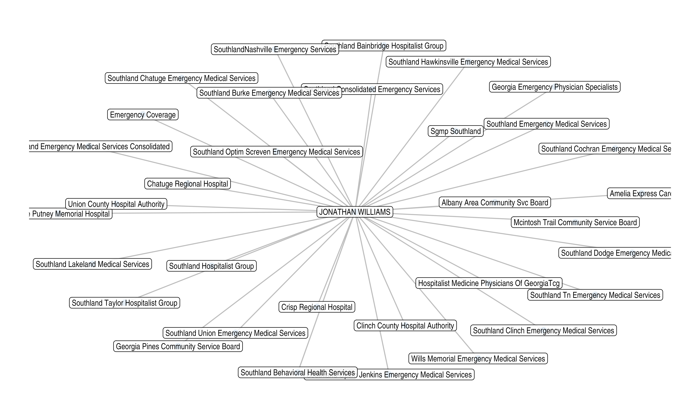

# Provider Networks

``` r
library(provider)
library(dplyr)
library(purrr)
library(stringr)
library(igraph)
library(tidygraph)
library(ggraph)
```

## Example: Edge Table

``` r
edge_table <- tribble(
  ~from,          ~to,             ~label,
  "Individual",   "Organization",  "Reassigns Benefits To",
  "Organization", "Individual",    "Accepts Reassignment From")

edge_table
```

    #> # A tibble: 2 × 3
    #>   from         to           label                    
    #>   <chr>        <chr>        <chr>                    
    #> 1 Individual   Organization Reassigns Benefits To    
    #> 2 Organization Individual   Accepts Reassignment From

## Example: Node Table

``` r
node_table <- tribble(
  ~name,            ~x,  ~y,
  "Individual",     1,    0,
  "Organization",   2,    0)

node_table
```

    #> # A tibble: 2 × 3
    #>   name             x     y
    #>   <chr>        <dbl> <dbl>
    #> 1 Individual       1     0
    #> 2 Organization     2     0

``` r
example <- graph_from_data_frame(
  d = edge_table,
  vertices = node_table,
  directed = TRUE)

example
```

    #> IGRAPH b5ebd2f DN-- 2 2 -- 
    #> + attr: name (v/c), x (v/n), y (v/n), label (e/c)
    #> + edges from b5ebd2f (vertex names):
    #> [1] Individual  ->Organization Organization->Individual

``` r
ggraph(example, layout = "manual", x = x, y = y) +
  geom_node_text(aes(label = name), size = 5) +
  geom_edge_arc(
    aes(label = label), 
                   angle_calc = 'none',
                   label_dodge = unit(2, 'lines'),
                   arrow = arrow(length = unit(0.5, 'lines')), 
                   start_cap = circle(4, 'lines'),
                   end_cap = circle(4, 'lines'),
    strength = 1) +
  theme_void() +
  coord_fixed()
```


## Provider Networks

``` r
williams <- reassignments("1346391299") |>
  mutate(
    provider     = str_glue("{first} {last}"),
    organization = str_squish(
      str_remove_all(
        str_to_title(organization), 
        regex("Llc|Inc| Pc|-|,+|\\.")))) |> 
  select(provider, 
         organization, 
         reassignments) |> 
  arrange(desc(reassignments))

williams
```

    #> # A tibble: 34 × 3
    #>    provider          organization                                  reassignments
    #>    <glue>            <chr>                                                 <int>
    #>  1 JONATHAN WILLIAMS Emergency Coverage                                      332
    #>  2 JONATHAN WILLIAMS Phoebe Putney Memorial Hospital                         241
    #>  3 JONATHAN WILLIAMS Southland Emergency Medical Services Consoli…           145
    #>  4 JONATHAN WILLIAMS Southland Bainbridge Hospitalist Group                  124
    #>  5 JONATHAN WILLIAMS Southland Consolidated Emergency Services               122
    #>  6 JONATHAN WILLIAMS Crisp Regional Hospital                                 117
    #>  7 JONATHAN WILLIAMS Union County Hospital Authority                         100
    #>  8 JONATHAN WILLIAMS Clinch County Hospital Authority                         93
    #>  9 JONATHAN WILLIAMS Sgmp Southland                                           93
    #> 10 JONATHAN WILLIAMS Hospitalist Medicine Physicians Of GeorgiaTcg            69
    #> # ℹ 24 more rows

## `{tidygraph}`

``` r
will_tdgrph <- tidygraph::as_tbl_graph(williams, directed = FALSE)

summary(will_tdgrph)
```

    #> IGRAPH c85acd2 UN-- 34 34 -- 
    #> + attr: name (v/c), reassignments (e/n)

``` r
will_tdgrph
```

    #> # A tbl_graph: 34 nodes and 34 edges
    #> #
    #> # An undirected multigraph with 1 component
    #> #
    #> # Node Data: 34 × 1 (active)
    #>    name                                             
    #>    <chr>                                            
    #>  1 JONATHAN WILLIAMS                                
    #>  2 Emergency Coverage                               
    #>  3 Phoebe Putney Memorial Hospital                  
    #>  4 Southland Emergency Medical Services Consolidated
    #>  5 Southland Bainbridge Hospitalist Group           
    #>  6 Southland Consolidated Emergency Services        
    #>  7 Crisp Regional Hospital                          
    #>  8 Union County Hospital Authority                  
    #>  9 Clinch County Hospital Authority                 
    #> 10 Sgmp Southland                                   
    #> # ℹ 24 more rows
    #> #
    #> # Edge Data: 34 × 3
    #>    from    to reassignments
    #>   <int> <int>         <int>
    #> 1     1     2           332
    #> 2     1     3           241
    #> 3     1     4           145
    #> # ℹ 31 more rows

``` r
ggraph(will_tdgrph, "stress") + 
  geom_edge_link(
    end_cap = circle(0.5, 'mm'), 
    edge.width = 0.5, color = "grey") +
  geom_node_point(
    show.legend = FALSE, 
    alpha = 1, 
    color = 'steelblue',
    size = 2.5) + 
  geom_node_label(
    aes(label = name),
    repel = FALSE,
    size = 3,
    alpha = 0.85,
    label.r = unit(0.25, "lines"),
    label.size = 0.1,
    check_overlap = TRUE) +
  theme_graph(fg_text_colour = 'white')
```


